# The Version Control Roadmap

This roadmap is designed to take you from a conceptual understanding to "production-ready" Git skills.

## Phase 1: Conceptual Foundations

__The "Why":__ Solving the "final_final_v2.zip" problem.

__VCS Types:__ Local, Centralized (SVN), and Distributed (Git).

__The Big Three:__ Git (the tool) vs. GitHub (the host) vs. Git Bash (the interface).

## Phase 2: The Git Lifecycle (Core Workflow)

__The Three States:__ Working Directory, Staging Area (Index), and Local Repository.

__Basic Commands:__ git init, git add, git commit, git status, git log.

__Undoing Mistakes:__ git checkout, git reset, git revert.

## Phase 3: Branching & Merging (Collaboration)

__Branching Strategy:__ Why we use branches (Feature-based development).

__Merging:__ Fast-forward vs. 3-way merges.

__Conflict Resolution:__ How to handle "Merge Conflicts" (A common interview favorite).

## Phase 4: Remote Mastery (GitHub)

__Remote Commands:__ git push, git pull, git fetch, git remote.

__The GitHub Flow:__ Forking, Pull Requests (PRs), and Code Reviews.

---

# Version Control System

___Use these definitions if an interviewer asks: "What is Version Control and why do we need it?"___

## 1. What is VCS?
___Interview Answer:___ "Version Control is a system that records changes to a file or set of files over time so that you can recall specific versions later. It allows multiple developers to work on the same codebase simultaneously without overwriting each other's work."

## 2. Why is it essential? (Key Benefits)
__Traceability:__ Every change is linked to an author and a timestamp. If a bug is introduced, you can trace exactly when and where it happened.

__Reversibility:__ If a new update breaks the system, you can instantly roll back to the last stable version.

__Branching:__ It allows for "sandboxed" development where you can experiment with new features without affecting the main production code.

## 💡 Pro-Tip for your Interview
When an interviewer asks about VCS, don't just say "it saves my code." Mention __"Collaboration Efficiency"__ and __"Data Integrity."__ These keywords signal that you understand the business value of the tool, not just the commands.

---
## Components of Version Control Systems ( ___Just Understand___ )
Version Control Systems work using a few core concepts that help teams manage code changes and collaborate efficiently.


__Repository:__ A central location that stores all project files along with their complete change history and metadata like author and commit message.

__Revision:__ A specific saved version of a file or project, identified using a unique ID such as a hash or number.

__Branch:__ A separate copy of the codebase used to develop features or fix bugs without affecting the main code.

__Merging:__ The process of combining changes from one branch into another, which may sometimes require resolving conflicts.

__Commit:__ A snapshot of changes made to the codebase at a specific time, used to track and manage project history.

---

first developer use zip files to track, but zip file hold all files they are changed or not, if current version zip file size is 2GB, again 2GB then we had lot of storage wastage.

---

## Types of VCS

Version Control Systems (VCS) are broadly categorized into three main types based on their architecture and history management: Local, Centralized, and Distributed systems.

### 🏛️ 1. Local Version Control Systems (LVCS)

These systems store version history in a database on a single local computer.

* __Mechanism:__ Changes are stored as patches relative to previous versions. 
* __Drawbacks:__ There is no remote collaboration; if the local database is lost or corrupted, the entire project history is lost. 
* __Examples:__ SCCS (Source Code Control System) and RCS (Revision Control System). 

___The Interview Answer:___
"A Local VCS is the simplest form of version control where changes are tracked entirely on a single local machine. It typically uses a simple database to store revisions of files as patches. While it prevents accidental deletion, it completely lacks collaboration capabilities."

#### Technical Architecture & Workflow
__How it works:__ It uses a database on your hard drive (like RCS - Revision Control System) that keeps track of file differentials (patches).

__The Analogy:__ It’s like using "Track Changes" in a Microsoft Word document saved on your desktop, or taking manual snapshots of a folder.

#### Pros & Cons (Interview Bullet Points)
__➕ Pros:__ Extremely fast (no network latency); very simple to set up.

__➖ Cons:__ Zero collaboration (others cannot access your history); ___Single Point of Failure (SPOF)___—if your hard drive crashes, your entire version history is permanently gone.

### 🏢 2. Centralized Version Control Systems (CVCS)

multiple developers collaborate to centralized server while using push and pull, and copy of centralized server consider as final copy of the project. 

because when a developer request from server then he receive latest version, so if server crashed then we lots the records and only recover latest or those version they are available at any developer.

complete version history unable to recover when central server crashed.

no all change log receive by developer only current latest version.

---
These systems rely on a single central server to store all project files and version history.

* __Mechanism:__ Developers check out files from the central repository to work locally and commit changes back to the server. 
* __Drawbacks:__ The central server is a single point of failure; if it goes down without backups, project history can be lost.  Offline work is limited.
* __Examples:__ Subversion (SVN), CVS, Perforce, and Microsoft TFS. 

__The Interview Answer:__
"A Centralized VCS uses a single master server that contains all the versioned files and the entire commit history. Developers only check out a snapshot of the latest version of the files to their local machine. To see the history or make a commit, they must communicate with the central server."

__Examples:__ SVN (Apache Subversion), Perforce, Microsoft TFS.

#### Technical Architecture & Workflow
    
* __The Analogy:__ Like a locked library book. You borrow the current book, edit it, and put it back. If the library is closed, you can't check out or return books.

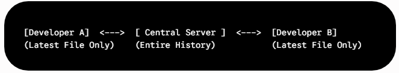

#### Pros & Cons (Interview Bullet Points)
* __➕ Pros:__

    * __Fine-grained Access Control:__ Administrators can easily control who owns which part of the project.

    * __Visibility:__ Everyone knows what everyone else is working on to some extent.

* __➖ Cons:__

    * __Network Dependent:__ If you lose internet connection, you cannot commit code, view history, or create branches.

    * __Severe Single Point of Failure:__ If the central database is corrupted and backups aren't fresh, the entire project history is lost. Developers only have the single snapshot they were currently editing.

---
### 🌍 3. Distributed Version Control Systems (DVCS)

here developer get complete history of project locally. with ignore mechanism like any media file with size 2GB so ignore it if regenerate or not necessary. only update and mark the changes of changes happen in current version in source files.

if server fail or corrupt then developer re-setup the server again because each contributor has complete history on there local machine.

---

In these systems, every developer has a complete local copy of the entire repository, including full history.

* __Mechanism:__ Developers commit changes locally and can synchronize with other repositories or a central server. 
* __Advantages:__ No single point of failure; robust offline capabilities; and easy branching and merging. 
* __Examples:__ Git (the industry standard), Mercurial, Bazaar, and Darcs.

__The Interview Answer:__
"In a Distributed VCS, developers don't just check out the latest snapshot of the files; they fully mirror the entire repository, including its full history, onto their local machine. The server acts merely as a hub for syncing rather than a single source of truth."

__Examples:__ Git, Mercurial.

#### Technical Architecture & Workflow
__The Analogy:__ Every developer has a complete backup copy of the entire library on their laptop.

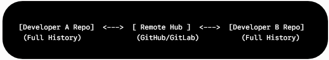

#### Pros & Cons (Interview Bullet Points)
* __➕ Pros:__

    * __No Single Point of Failure:__ If the main server crashes, any developer's local repository can be used to fully restore the server.

    * __Offline Functionality:__ You can commit, create branches, and view full logs while on an airplane or without an internet connection.

    * __Performance:__ Operations (like branching or searching history) are nearly instantaneous because they happen on your local SSD, not over the network.

* __➖ Cons:__

    * __Initial Clone Time:__ Cloning a massive, decades-old repository for the first time can take a while because you are downloading the entire history.

    * __Binary File Handling:__ It struggles with massive binary files (like video game assets or heavy videos) because every version of that heavy file gets saved in everyone's history.
---

## Difference

Interviewers love to ask the difference between SVN (Centralized) and Git (Distributed).

|Type|Storage Location|Collaboration|Key Risk|
|:--:|:--:|:--:|:--:|
|Local|Single local machine|None|Local data loss|
|Centralized (CVCS)|Central server|Real-time via server|Server failure|
|Distributed (DVCS)|Every developer's machine|Decentralized/Synced|Complexity/Learning curve|
---

|Feature|Centralized (CVCS)|Distributed (DVCS)|
|:--:|:--:|:--:|
|Storage|One central server holds the entire history.|Every developer has a full copy of the history locally.|
|Offline Work|Limited; you need a connection to commit.|Full; you can commit and branch offline.|
|Risk|If the central server crashes, history is lost.|Every local copy acts as a backup.|
|Speed|Slower (requires network for most tasks).|Faster (most operations are local).|
---

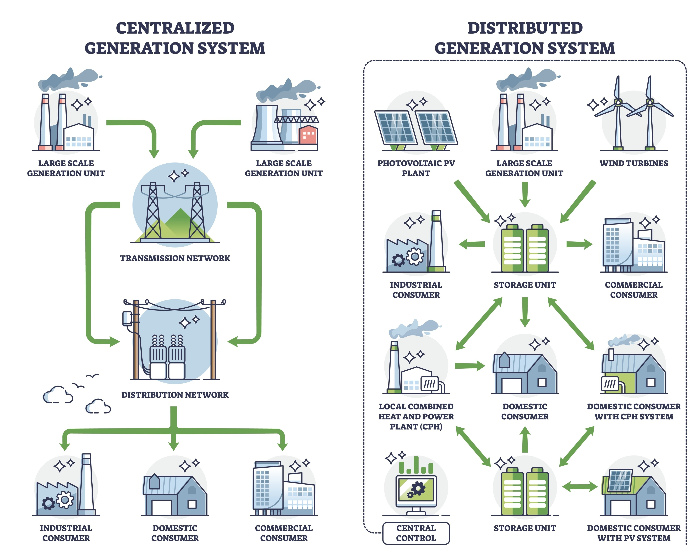

🎯 The Ultimate Comparison Matrix (Keep this in mind for direct comparisons)
|Dimension|Centralized (CVCS)|Distributed (DVCS)|
|:--:|:--:|:--:|
|Where is History Stored?|Only on the Central Server.|On the Server AND on every Developer's machine.|
|Commit Operation|Directly updates the central server (Network required).|Updates the local repository first (Offline friendly).|
|Branching Speed|Slower, often requires server coordination.|Instantaneous, local creation.|
|Security Setup|High control (Can restrict access to a single folder).|All-or-nothing (A user clones the entire repo or nothing).|
---

---

### Summary

Version control (also known as source control or revision control) is a software engineering practice and set of tools used to track, manage, and record changes to files—primarily source code—over time.  It serves as a safety net that allows developers to __collaborate__ without overwriting each other's work, __revert__ to previous versions if errors occur, and maintain a complete __history__ of modifications including who changed what and when.

The three primary types of version control systems are:

* __Centralized Version Control Systems (CVCS):__ Store all file versions in a single central server; examples include __Subversion (SVN)__. 
* __Distributed Version Control Systems (DVCS):__ Allow every developer to have a local copy of the entire repository history, enabling offline work and robust branching; the most popular tool is __Git__, followed by __Mercurial__. 
* __Local Version Control Systems (LVCS):__ Store changes on a single computer, suitable for individual projects but lacking collaboration features; an example is the __Revision Control System (RCS)__. 

In modern DevOps workflows, version control is essential for coordinating distributed teams, facilitating code reviews, and enabling automated integration and deployment pipelines by providing a single source of truth for application artifacts.

---

# 🔥 Common Interview Follow-Up Questions
__Q1: "If Git is distributed, why do we still use centralized platforms like GitHub?"__
__Your Answer:__ "Git is functionally distributed, meaning it doesn't need GitHub to work—two developers can sync directly over an IP address. However, we use GitHub because it provides a __centralized collaboration platform__ that adds crucial project management tools like Pull Requests, Issue Tracking, CI/CD pipelines, and user access management."

__Q2: "When would a company choose SVN (Centralized) over Git (Distributed) today?"__
__Your Answer:__ "A company might choose CVCS if they deal with __extremely massive monolithic codebases or heavy binary assets__ (like game development studios using Perforce). In those cases, downloading the entire historical ledger via Git would crash local hard drives. CVCS allows developers to download only the specific folder they need to work on."

---

# Types of Version Control Systems (GFG)

## 1. Local Version Control Systems (Local VCS)
A Local Version Control System (LVCS) stores all project versions on a single computer and is mainly used by one user without remote collaboration.

### Characteristics:

* No internet or server dependency.
* Useful for individual projects.
* Limited to single-user environments.

## 2. Centralized Version Control Systems
In a Centralized Version Control System, all the files and their version history are stored in a single central server. Developers connect to this server to access or modify files.

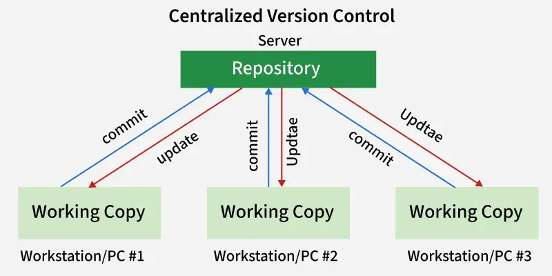

* __Update/Checkout:__ A developer retrieves the latest version of the files from the central server.
* __Make Changes:__ The developer works on the files.
* __Commit:__ The developer saves (commits) the changes directly back to the central server, making them immediately available to everyone else.

### __Pros:__

* Enables collaboration among multiple developers through a central repository.
* Provides visibility into project activities and changes.
* Allows fine-grained access control for administrators.
### __Cons:__

* Has a single point of failure because everything depends on the central repository.
* If the server goes down, developers cannot collaborate or commit changes.

## 3. Distributed Version Control Systems
A Distributed Version Control System allows each developer to have a local repository along with a working copy of the project. Changes made in the local repository are not automatically visible to others.

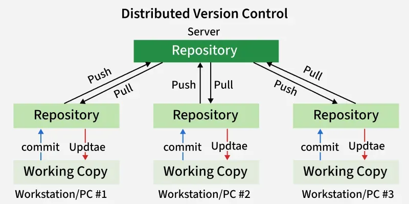

* __Commit:__ Saves changes to the local repository, visible only to the developer.
* __Push:__ Uploads committed changes to the central/shared repository so others can access them.
* __Pull:__ Downloads changes from the central repository to the local repository.

___Note:___ DVCS uses a two-step process (commit -> push) to share changes with other developers.

---

# Git

Git is a version control system that allows you to track changes to your files and collaborate with others. It is used to manage the history of your code and to merge changes from different branches.

Git is a distributed version control system (DVCS) that is used to track changes in source code during software development. It permits multiple developers to work on a project together without interrupting each other's changes. Git is especially popular for its speed, and ability to manage both small and large projects capably.

It helps developers collaborate, manage different versions of code, and roll back to previous states if needed.

Git is an open-source distributed version control system that helps teams track and manage code changes, collaborate seamlessly and work on projects of any size. It keeps a history of every change, allowing you to revisit or restore previous versions and makes it easy to fix mistakes without losing progress.

* Multiple developers can work together and merge changes easily.
* Revert to previous versions whenever needed.
* Develop features separately and merge them safely.
* Each developer has a full copy of the repo.
* Stores snapshots of the entire tree and optimizes storage internally using compression and delta encoding.

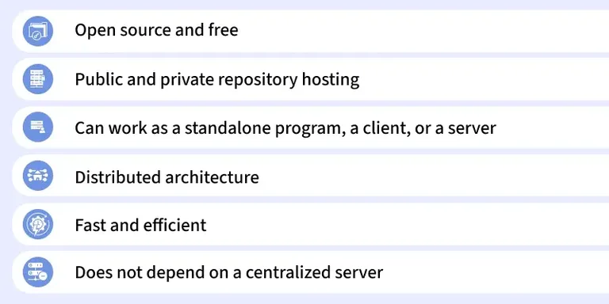
___<center>feature of Git</center>___

## 1. What is Git?
__Interview Answer:__

"Git is a free, open-source __Distributed Version Control System (DVCS)__ designed to handle everything from small to very large projects with speed and efficiency. Unlike older systems that store data as list of file changes, Git thinks of its data more like a stream of __snapshots__ of a miniature filesystem."

## 📜 The History & The "Why" (The Linux Origin Story)
Interviewers love when candidates know why a technology was born. It shows you don't just memorize tools—you understand engineering problems.

### The Scenario:
In the early days of the Linux Kernel project (1991–2002), changes were passed around as archived files and patches. In 2002, the project began using a proprietary CVCS called __BitKeeper__.

In 2005, the relationship between the Linux community and the company that owned BitKeeper broke down, and the free-of-charge status was revoked. Linus Torvalds (the creator of Linux) needed a new system immediately, but none of the existing open-source options met his strict performance and security requirements.

__The Creation:__
Linus Torvalds famously decided to write his own tool over a single weekend. He laid out specific design goals that define Git today:

* __Speed:__ It had to process thousands of patches rapidly.

* __Simple design:__ Easily manageable internal structures.

* __Strong support for non-linear development:__ Allowing thousands of parallel branches.

* __Fully distributed:__ No reliance on a single central authority.

* __Data Integrity:__ Guaranteeing that what went into the system came out exactly the same.
---

# Git Features

### ⚡ Core Features of Git
* __Distributed Architecture:__ Every collaborator has a local clone of the project repository with full history.

* __Cryptographic Data Integrity:__ Git hashes everything using SHA-1 (and newer secure hashing algorithms). Every file and commit is assigned a unique 40-character hexadecimal string. You cannot alter a single byte of a file without Git tracking it.

* __Lightweight Branching:__ Branches in Git are simple pointers to a specific commit. Creating or switching branches takes milliseconds.

* __The Staging Area (Index):__ A unique buffer zone where you can format and curate exactly what changes you want to include in your next commit, rather than committing everything blindly.

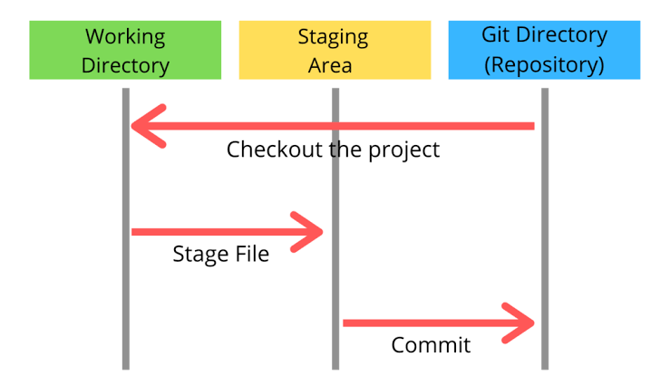
___<center>The Three States Architecture of Git. Source: Medium</center>___
---
## 📖 Key Git Terminologies
Memorize these precise definitions. Interviewers use them to test practical familiarity.

* __Repository (Repo):__ A directory containing your project files and a hidden .git folder that tracks the entire historical timeline of changes.

* __Commit:__ A snapshot of your repository saved to the history timeline. Think of it as a checkpoint or a save file in a video game.

* __Working Directory:__ The actual local folder on your computer where you are currently adding, editing, and deleting files.

* __Staging Area (Index):__ A middle-man staging ground that prepares modified files to be packaged into the next commit.

* __Branch:__ An independent line of development. The default branch is typically named main or master.

* __Head:__ A pointer referencing your current position in the project's historical timeline.

* __Clone:__ Act of downloading a complete copy of an existing remote repository onto your local hard drive.

---

# ☁️ What is GitHub?
__Interview Answer:__

"GitHub is a cloud-based hosting platform for Git repositories. While Git is the core command-line utility used to track code locally, GitHub provides a graphical user interface, access control, and specialized collaboration features like Pull Requests and issue tracking tools built around Git."

## ⚔️ The Ultimate Showdown: Git vs. GitHub
This is a classic introductory interview question. A weak candidate confuses them; a strong candidate defines them as separate layers of the stack.

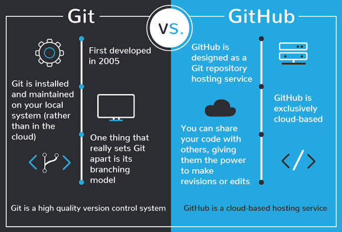
___<center>Git vs. GitHub Comparison. Source: XpertLab</center>___

---

|Dimension|Git|GitHub|
|:--:|:--:|:--:|
|What is it?|A desktop software tool (CLI/engine).|A cloud-based service platform.|
|Where does it live?|Installed directly on your local computer.|Hosted on remote cloud servers owned by Microsoft.|
|Core Job|Tracks local version history and manages files.|Hosts copies of your Git repositories online for sharing.|
|Interface|Command line interface (CLI) or local desktop application.|Web-based graphical interface (GUI).|
|Key Features|Commits, branching, merging, rebasing.|Pull Requests, Issues, Actions (CI/CD), User Management.|
|Internet Dependency|Works 100% offline.|Requires network access to interact with the platform.|

---

# 🔥 Interview Follow-Up Question
__Q: "Can I use Git without GitHub?"__
__Your Answer:__ "Yes, absolutely. Git is a self-contained local tool. You can track your entire history, create branches, and execute commits offline on your laptop without ever creating a GitHub account. You can even share repositories over a local network or via email patches. GitHub is simply a convenient online location to back up and share those local repositories."

---

# Git and Github are different
Git is a version control system that is used to track changes to your files. It is a free and open-source software that is available for Windows, macOS, and Linux. Remember, GIT is a software and can be installed on your computer.

Github is a web-based hosting service for Git repositories. Github is an online platform that allows you to store and share your code with others. It is a popular platform for developers to collaborate on projects and to share code. It is not that Github is the only provider of Git repositories, but it is one of the most popular ones.

---

# Git Feature (Short)

1. __Store Snapshots, not differences, means not store complete difference between new and old version just store current changes with message, timestamp.__

In Git, a snapshot is a representation of your entire codebase at a specific point in time, created when you commit changes.  Unlike version control systems that track changes as a series of deltas or diffs, Git stores a complete snapshot of all tracked files for every commit, allowing for fast operations like switching branches or checking history without replaying previous changes.

__Key characteristics of Git snapshots include:__

__Commit Association:__ Each snapshot is tied to a commit object, which contains metadata (author, date, message) and references a tree object representing the file structure. 
__Efficiency:__ While conceptually a full copy, Git optimizes storage by using __blob (Binary Large Object) objects__ for file content.  If a file hasn't changed since the last commit, the new snapshot simply references the existing blob rather than storing a duplicate.
__Immutability:__ Once created, a snapshot (commit) is permanent and cannot be altered, ensuring the integrity of the project history. 
__Staging Process:__ Snapshots are composed in the staging area (index) using git add before being finalized into the repository with git commit.

This snapshot-based approach enables Git to perform operations quickly, as checking out a commit involves retrieving the stored tree structure rather than calculating differences from previous states. 

2. __Almost each operation is local.__
3. __Git has integrity.__

    Git prevent the manual changes in .git folder and reflect on project. Because git maintain ___SHA(Secure Hash Algorithms, family of cryptographic hash functions)-1 checksum___ for each changes. means each file has unique hexadecimal checksum, if something will be change then checksum vary. SHA-1 Checksum use to identify the received file is original or not, like i download a file of nodejs installation and when download completed i calculate checksum using tools and match with listed checksum on nodejs file provided on website, if they vary means downloaded file corrupted and not trust wealthy.

4. __Git generally only adds data.__

    means a git repository always grows, because always changes save and delete, we can delete the changes but most of the cases only save the changes. (change → save).
---

# Features of Git (GFG)

1. __Open Source__

Git is free and open-source, maintained by a community of developers. Anyone can contribute to its development, suggest features, or fix bugs.

* There is a large community support with plenty of tutorials, guides, and forums.
* Constant updates and improvements from contributors worldwide.
* No licensing cost; anyone can use it freely for personal or commercial projects.

2. __Distributed System__

Unlike centralized version control systems, Git is fully distributed. Every developer has a complete copy of the repository, including all history, branches, and tags.

* Work offline and commit changes without a network connection.
* Redundancy ensures backups across multiple local repositories.
* Faster operations since most actions are local.
* Enables non-linear development with multiple branches.

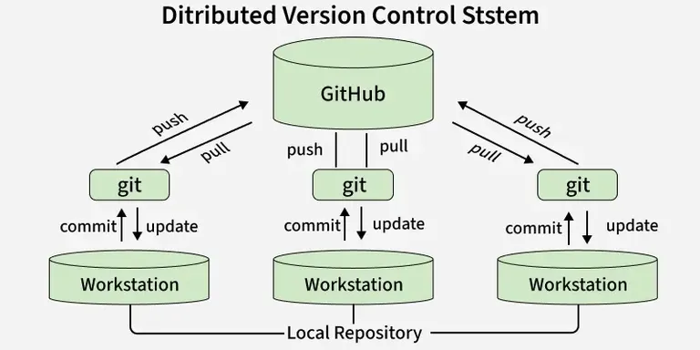

3. __Branching__

A branch in Git is like a parallel version of your code, allowing you to work on different tasks independently without affecting the main codebase.

* Lets you develop new features, fix bugs, or experiment safely.
* Each branch maintains its own set of commits and changes.
* You can later merge your branch back into the main branch once the work is complete.
* Helps in isolating issues, so bug fixes don’t interfere with other development work.

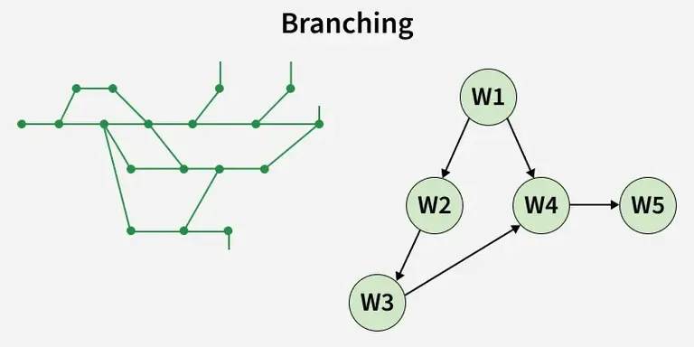
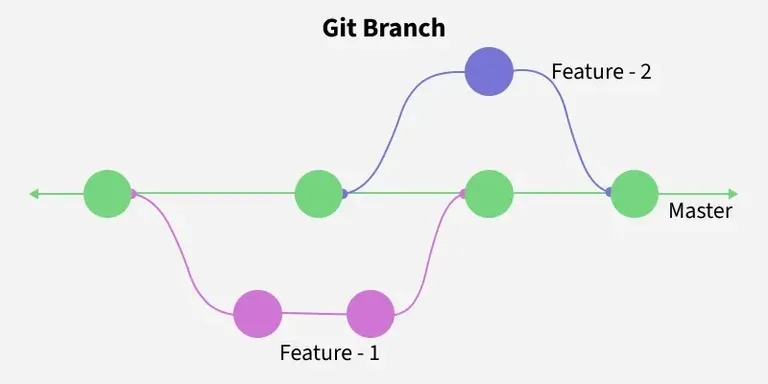

__Types of Branches__

* __Main Branch:__ The primary stable codebase, usually main or master.
* __Hotfix Branch:__ Used to quickly fix critical production issues and then merged back into main.
* __Develop Branch:__ Combines all completed features for integration, testing, and ongoing development.
* __Feature Branches:__ For new features, e.g., feature-login.
* __Bugfix Branches:__ For fixing bugs, e.g., bugfix-header.
* __Release Branches:__ For preparing a version for production.

__Example__

If a bug is found in the main branch, you can create a separate bugfix branch, fix the issue there, test it, and then merge it back into the main branch

4. __Merging__

Merging integrates changes from one branch into another, combining their histories to update the target branch.

It allows you to combine the work done in different branches and resolve any conflicts that arise.

* Merging is the process of combining changes from one branch into another.
* Typically, you merge a feature branch into the main branch after development is complete.
* Git tries to automatically integrate changes, but sometimes conflicts need to be resolved manually.

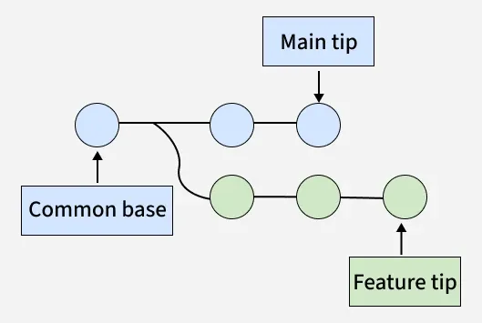
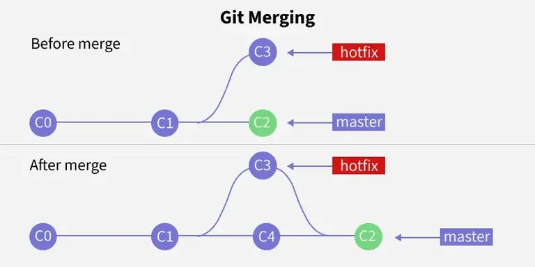

__Types of Merges__
    
__i. Fast-Forward Merge__

* Happens when the main branch has not moved forward since the branch was created.
* Git just moves the main branch pointer forward to the latest commit.
__ii. Three-Way Merge__

* Happens when both branches have new commits since they diverged.
* Git creates a new merge commit that combines changes.

__iii. Merge Conflicts__

* Occurs when changes on both branches affect the same line of a file.
* Git cannot automatically merge and asks you to resolve conflicts manually.

5. __History Tracking__

Git keeps a complete history of all changes to the codebase. Every commit is recorded with a timestamp, author, and a message describing the change.

* You can see the evolution of the project over time.
* Ability to revert to a previous state if something breaks.
* Helps identify bugs by checking which changes introduced an issue.
__Example:__ If a new feature causes a bug, you can review the commit history to find exactly which changes caused the problem and fix it.

6. __Staging Area (Index)__
Git has a staging area (index) where changes can be reviewed before being committed. This allows selective commits instead of committing all changes at once.

* Enables careful review of code changes before they become part of the history.
* Helps in splitting large changes into smaller, meaningful commits.

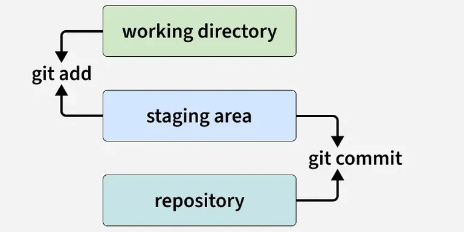

__Example:__ You edited three files but only want to commit two. You can stage only those two files and commit them, leaving the third file for later.

7. __Speed__
Git is highly optimized for speed. Its underlying data structures, such as the SHA-1 hash and compressed snapshots, make operations like committing, branching, and merging very fast.

* Efficient for large projects with thousands of files.
* Fast operations allow developers to experiment and iterate quickly.
__Example:__ Creating a new branch or switching between branches takes almost no time, even for large codebases.

8. __Security__
Git uses cryptographic hash functions to ensure the integrity of the codebase. Historically, it used SHA-1, but it is transitioning to SHA-256 to improve security against collision attacks.

* Tampering is detectable because any change in the code changes the hash.
* Ensures the integrity of commits and repository history.
__Example:__ If someone tries to change old commits, Git will detect that the hashes don’t match, protecting the code from unnoticed tampering.

9. __Collaboration__
Git makes teamwork seamless by allowing multiple developers to work on the same codebase.

* Developers can clone repositories and contribute independently.
* Changes can be merged smoothly.
* Platforms like GitHub/GitLab provide pull requests and code reviews for effective collaboration.

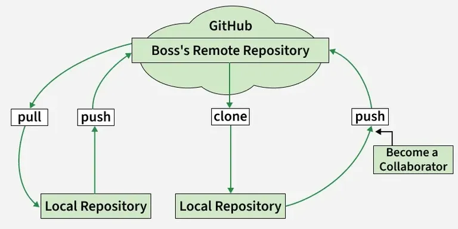

10. __Cross-Platform Support__
Git works across major operating systems including Windows, Linux, and macOS.

* Provides consistent performance on all platforms.
* Wide adoption across teams with different systems.

11. __Integration with DevOps & CI/CD Tools__
Git integrates seamlessly with DevOps pipelines and CI/CD tools like Jenkins, GitHub Actions, and GitLab CI.

* __Continuous Integration (CI):__ Every commit triggers automated builds and tests.
* __Continuous Deployment (CD):__ Tested code can be automatically deployed to staging or production.
* __Branch-based workflows:__ Different branches can trigger different pipelines (e.g., dev - test, main - production).
* __Tool Support:__ Works with Jenkins, GitHub Actions, GitLab CI, CircleCI, AWS CodePipeline, etc.
---

# Check your git version
To check your git version, you can run the following command:

``` powershell
git --version
or
git -v
```

This command will display the version of git installed on your system. Git is a very stable software and don’t get any breaking changes in majority of the cases.

# Git Configuration

Github has a lot of settings that you can change. You can change your username, email, and other settings. Whenever you checkpoint your changes, git will add some information about your such as your username and email to the commit. There is a git config file that stores all the settings that you have changed. You can make settings like what editor you would like to use etc.

## ⚙️ 1. What is Git Configuration?
__Interview Answer:__

"Git Configuration is the process of setting up global or repository-specific variables that customize Git's behavior, environment, and user identity. Most importantly, it binds an identity (name and email) to every commit you make, establishing clear authorship across the codebase."

## 🛠️ 2. Why is Git Configuration Needed?
If an interviewer asks, ___"Why can't I just start using Git right after installing it without configuring anything?"___, here are the two core technical reasons:

### A. Strict Accountability (The Commit Identity)
Git is built on the concept of absolute integrity and traceability. Every single commit object in Git contains metadata, including the author's name and email address.

* __The Problem:__ If Git allowed you to commit without an identity, a team would have no way of knowing who introduced a specific bug or wrote a feature.

* __The Guardrail:__ If you try to run git commit on a fresh system without configuring your identity, Git will completely block the operation and throw an error telling you to set your username and email first.

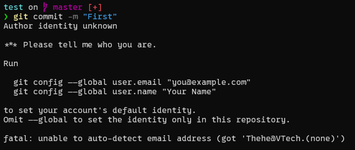

### B. Customizing Environment and Workflows
Configuration allows you to tailor your development environment. You can set your default text editor (like VS Code or Vim) for writing commit messages, configure line-endings across different operating systems (Windows vs. Mac), or set up custom shortcut aliases for long commands.

## 🗂️ 3. The Three Levels of Git Configuration

Git stores configuration settings in plain text files across three distinct levels of your operating system. If a setting is defined in multiple places, the more specific level always overrides the broader one.

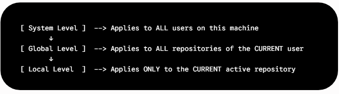

### 1. Local (```--local```)
* __Scope:__ Applies strictly to the single repository you are currently working in.

* __File Location:__ Stored inside the ```.git/config``` file of that specific project directory.

* __Interview Scenario:__ Best used when you want to use your personal email for a personal project, but a corporate email for a work project on the same computer.

### 2. Global (```--global```)
* __Scope:__ Applies to all repositories for your specific operating system user account.

* __File Location:__ Stored in your user home directory (e.g.,``` ~/.gitconfig``` on Mac/Linux or ```C:\Users\username\.gitconfig``` on Windows).

* __Interview Scenario:__ This is the most common level. You set this once when setting up a new laptop so that all your projects automatically use your correct identity.

### 3. System (```--system```)
* __Scope:__ Applies to every single user and every single repository across the entire physical operating system.

* __File Location:__ Stored in a system-wide file (e.g., ```/etc/gitconfig```). It requires administrative or root privileges to modify.

* __Interview Scenario:__ Rarely used by individual developers; mostly used by IT administrators setting up shared company servers.

## 💻 4. Core Configuration Commands to Know

An interviewer might ask you to describe or write the basic commands to configure Git.

### Setting your Identity (Mandatory First Step)
```bash
# Set your global name
git config --global user.name "Your Name"

# Set your global email address
git config --global user.email "your.email@example.com"
```

### Checking your Settings
```Bash
# List all active configurations along with where they originate
git config --list --show-origin

# Read a specific configuration value
git config user.email
```

### Useful Quality-of-Life Configurations
```Bash
# Change the default text editor for Git to VS Code
git config --global core.editor "code --wait"

# Set the default branch name to 'main' for all new repositories
git config --global init.defaultBranch main
```

## 🔄 5. Reset Configuration 

To reset Git configuration, you can either remove specific settings or delete the entire configuration file to revert to defaults. Git configurations are stored at three levels: __Local__ (within ```.git/config``` in your project), __Global__ (in ```~/.gitconfig``` or ```~/.config/git/config``` for your user), and __System__ (in ```/etc/gitconfig``` for all users).

### Method 1: Reset Specific Settings

Use the ```git config --unset``` command to remove individual keys. Replace ```--global``` with ```--local``` or ```--system``` as needed. 

* __Remove a global setting:__
```bash
git config --global --unset user.name
```

* __Remove all instances of a key (if duplicated):__
```bash
git config --global --unset-all user.name
```

* __Remove an entire section (e.g., 'user'):__
```bash
git config --global --remove-section user
```

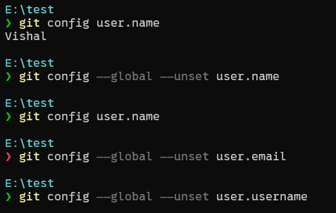

### Method 2: Reset All Configurations (Factory Defaults)

To reset all configurations to their default state, delete the relevant configuration file. Git will recreate it with defaults when needed. 

* __Reset Global Config:__
```bash
rm ~/.gitconfig
```

* __Reset Local Config (for current repo):__
```bash
rm .git/config
```

* __Reset System Config (requires sudo):__
```bash
sudo rm /etc/gitconfig
```

After resetting, verify your configuration with ```git config --list --show-origin``` to ensure settings are cleared or updated correctly.

## Practical

### Before Setting Configuration

```bash 
# config file path with key-value pair
git config --list --show-origin
```

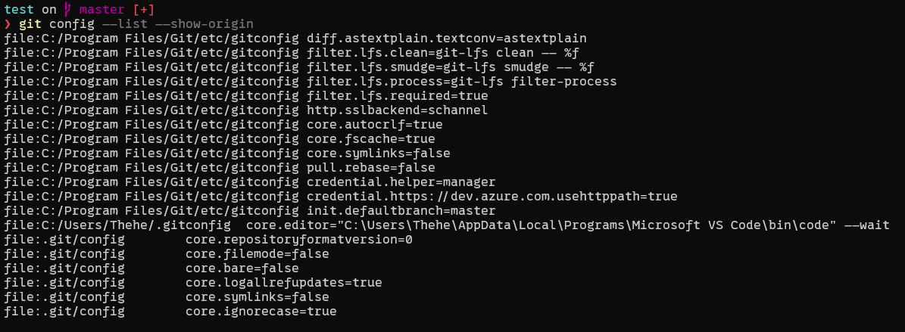

```bash
# only key-value pair of config files from all paths
git config --list
```

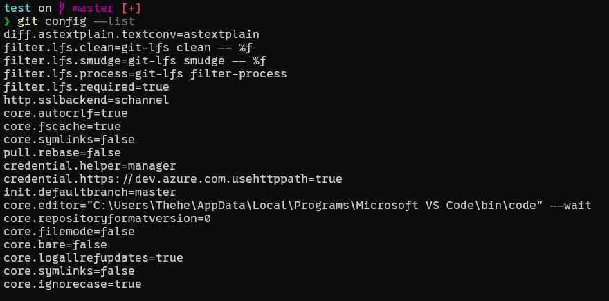

### Setting Configuration

```bash
git config --global user.name "Vishal"
```

```bash
git config --global user.email "vishalv.c22.3@gmail.com"
```

```bash
git config --global user.username "TagCoding223"
```

### After Configuration

```bash
git config --list
```

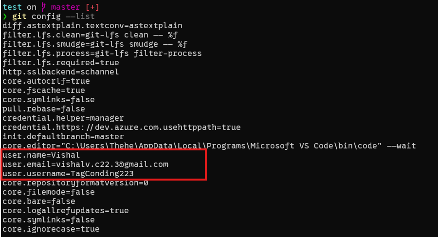


```bash
git config --list --show-origin
```

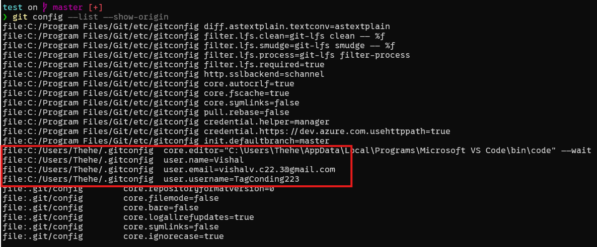

### Individual Checking

```bash
test on  master [+]
❯ git config user.name
Vishal

test on  master [+]
❯ git config user.username
TagCoding223

test on  master [+]
❯ git config user.email
vishalv.c22.3@gmail.com
```

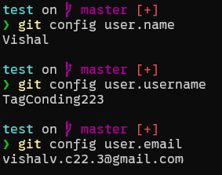

---

## 🔥 Common Interview Follow-Up Question
__Q: "If I have a global email set to ```personal@gmail.com```, but my company project requires ```work@company.com```, how do I handle this without breaking my global settings?"__
__Your Answer:__ "You can override the global configuration by setting a local configuration inside that specific corporate project folder. I would navigate into the company repository and run the command without the ```--global``` flag: ```git config user.email "work@company.com"```. Git will write this directly to the local ```.git/config``` file, which takes precedence over the global file just for this repository."

---

# Git - Three Stage/Area Architecture or Git Lifecycle states

When an interviewer asks, ___"Explain the lifecycle of a file in Git,"___ they want to see if you understand how a file transitions from a raw script on your hard drive to an immutable snapshot in Git’s history ledger.

## 🗺️ The Two Macro States: Untracked vs. Tracked

At the highest level, Git categorizes every file in your project folder into one of two states:

__1. Untracked:__ Any file in your working directory that was not present in your last Git snapshot (commit) and has not yet been staged. Git essentially ignores these files until you explicitly tell it to look at them.

__2. Tracked:__ Any file that Git already knows about. Tracked files have been included in a past snapshot and can exist in one of three sub-states: __Unmodified, Modified,__ or __Staged__.

## 🔄 The 4 Core Sub-States of the Git Lifecycle (File Status Lifecycle)

As you write code, your files cycle through these four distinct states.

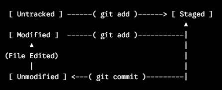

__1. Untracked__

* __The Status:__ The file is completely new. It exists on your local hard drive, but it is not part of Git's tracking database.

* __How it gets here:__ You create a brand new file (e.g., touch index.js).

* __Next step:__ Run git add <file> to move it to the Staged state.

__2. Staged__

* __The Status:__ The file has been marked in its current version to go into your next history snapshot. It lives in Git's Index (or buffer zone).

* __How it gets here:__ You run git add on either a brand new file or a modified file.

* __Next step:__ Run git commit to permanently save it, which moves it to the Unmodified state.

__3. Unmodified__

* __The Status:__ The file is safely committed. The version of the file on your hard drive matches exactly what is stored in the latest Git checkpoint (HEAD).

* __How it gets here:__ You successfully execute a git commit.

* __Next step:__ If you open the file and type even a single character, it automatically transitions to the Modified state.

__4. Modified__

* __The Status:__ You have changed the file locally, but you have not yet committed those changes to your history, nor have you staged them for the next commit.

* __How it gets here:__ You edit a file that was previously tracked and saved.

* __Next step:__ Run git add to move these new changes back to the Staged state.

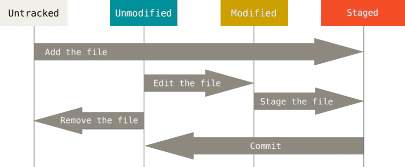

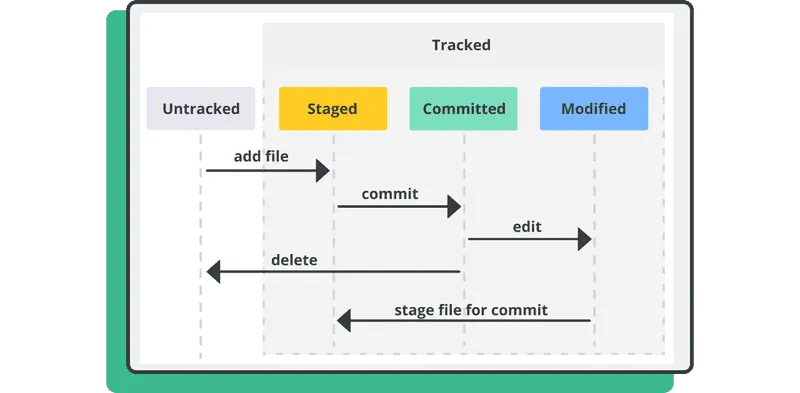

---

## 🗃️ The 3 Architectural Areas (Where these states live)

To ace this in an interview, you must map these lifecycle states to Git's three internal architectural layers:

When an interviewer asks, "Explain Git’s three-tier architecture," they are asking how Git isolates your active workspace from your permanent history database.

__1. The Interview Answer__
"Git operates on a three-tier architectural structure consisting of the __Working Directory__, the __Staging Area (Index)__, and the __Git Directory (Local Repository)__. This separation allows developers to carefully craft, review, and commit isolated changes rather than blindly saving everything on their hard drive."

__2. Deep Dive Into the Three Tiers__

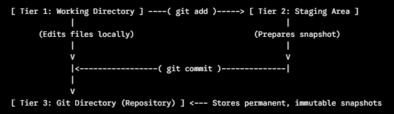

__Tier 1: The Working Directory (Working Tree)__
* __What it is:__ This is the actual physical folder on your computer's filesystem where you can see, open, and edit your code files using your IDE (like VS Code).

* __State of files:__ Files here are either __Untracked__ (brand new) or __Modified__ (edited since the last save).

* __Analogy:__ Your physical office desk where you are currently writing out individual sheets of scrap paper.

__Tier 2: The Staging Area (The Index)__
* __What it is:__ A highly optimized, hidden binary file located at ```.git/index```. It acts as a middle-man prep zone. It contains a preview of exactly what files and changes will be packaged into your next history checkpoint.

* __State of files:__ Files here are __Staged__.

* __Analogy:__ A shipping box sitting next to your desk. You pick up specific sheets of paper from your desk, put them in the box, and organize them before sealing it up.

__Tier 3: The Git Directory (The Local Repository)__
* __What it is:__ This is the hidden ```.git``` folder inside your project. It is Git's actual database. It contains all the historical compressed metadata, commit objects, and pointers (```HEAD```, branches) for the entire lifetime of the project.

* __State of files:__ Files here are stored as compressed immutable blobs within ```Unmodified``` historical snapshots.

* __Analogy:__ The company's permanent archival vault. Once the shipping box (Staging Area) is sealed and committed, it goes into this vault with a unique tracking number (SHA-1 Hash).

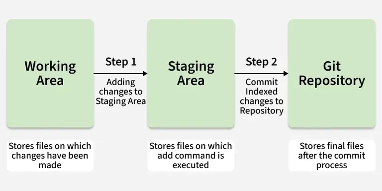

Git utilizes a three-tier architecture consisting of the Working Directory, the Staging Area, and the Repository. 

* __Working Directory:__ This is the local folder where developers edit, add, or delete files. Changes made here are untracked by Git until explicitly added to the next stage. 
* __Staging Area (Index):__ This intermediate layer holds a preview of changes selected for the next commit. It allows developers to selectively stage specific modifications, ensuring only intended changes are prepared for versioning. 
* __Repository:__ This is the local database where committed snapshots are permanently stored. It maintains the complete history of the project, including all commits, branches, and tags.

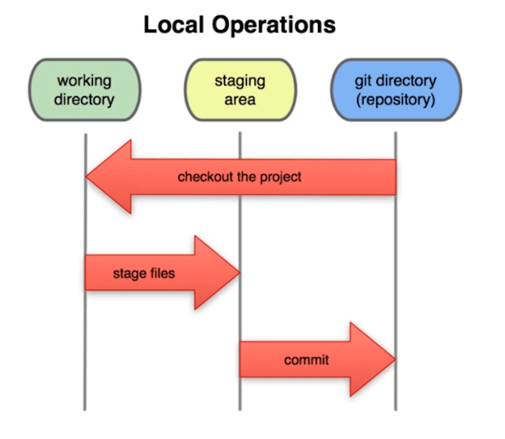

|Layer / Area|What It Is|Applicable Lifecycle States|
|:--:|:--:|:--:|
|Working Directory|The actual directory on your computer where you see and edit your project files.|```Untracked```, ```Modified```, ```Unmodified```|
|Staging Area (Index)|A hidden, highly optimized binary file inside .git that lists exactly what changes will be packaged into the next commit.|```Staged```|
|Git Directory (Repository)|The local database (.git folder) where Git permanently stores your project's metadata and object database history.|Contains all historical ```Unmodified``` snapshots.|

## Complete git flow

Usual flow looks like this:


A complete git flow, along with pushing the code to github looks like this:

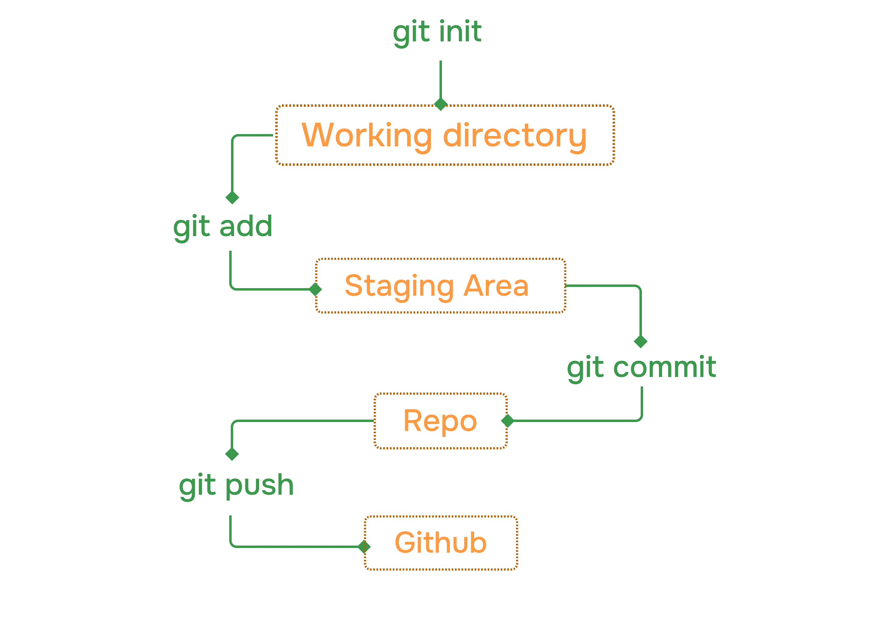

When you want to track a new folder, you first use init command to create a new repository. Then you can use add command to add the folder to the repository. After that you can use commit command to save the changes. Finally you can use push command to push the changes to github. Of course there is more to it but this is the basic flow.

---

## 💻 Practical Command Walkthrough
Let's see how Git reflects these states when you run git status.

### Scenario A: Creating a New File

```Bash
$ touch app.js
$ git status
# Output:
# Untracked files:
#   (use "git add <file>..." to include in what will be committed)
#	app.js
```

### Scenario B: Staging the File

```Bash
$ git add app.js
$ git status
# Output:
# Changes to be committed:
#   (use "git rm --cached <file>..." to unstage)
#	new file:   app.js
```

### Scenario C: Committing the File

```Bash
$ git commit -m "Initial architecture setup"
$ git status
# Output:
# On branch main
# nothing to commit, working tree clean  <-- Everything is now UNMODIFIED
```

---

#🔥 Common Interview Follow-Up Questions
__Q1: "What is the point of the Staging Area? Why can't we just commit directly from the Working Directory?"__

__Your Answer:__ "The Staging Area acts as a crucial preparation buffer. It allows developers to craft clean, precise, and atomic commits. For example, if I edit five different files to fix two unrelated bugs, I don't want to lump them into one messy commit. The Staging Area allows me to stage two files for 'Bug A', commit them, and then stage the remaining three files for 'Bug B'. It gives us total control over the history narrative."

To commit changes directly in Git, you must first stage your modifications using git add, then record the snapshot with git commit. 

The most common command to create a commit with an inline message is:

```bash 
git commit -m "Your commit message here"
```

__Key Variations__
* __Skip Staging for Tracked Files:__ Use ```git commit -am "message"``` to automatically stage all modified and deleted tracked files and commit them in one step. Note that this does __not__ include new, untracked files. 
* __Interactive Commit:__ Use ```git commit -p``` or ```git add -p``` to selectively stage specific changes (hunks) within files before committing. 
* __Amend Last Commit:__ Use ```git commit --amend -m "new message"``` to modify the most recent commit (e.g., to fix a typo or add forgotten changes) without creating a new commit entry.

__Workflow Context__
__1. Stage Changes:__ ``git add <file>`` or ``git add`` .
__2. Commit:__ ``git commit -m "Description of changes"``
__3. Push to Remote:__ ``git push origin <branch-name>`` (e.g., main or master) to share the commit with the remote repository.

__Skip Stage Area__ (___Not Recommended___)

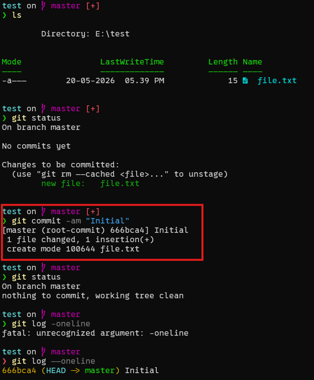

___git commit -am "message" is this command skip stage area___

Yes, the command ``git commit -am "message"`` skips the manual staging step for __already tracked__ files.

* __How it works:__ The ``-a`` flag automatically stages all modified and deleted files that are already being tracked by Git, then immediately commits them. 
* __Limitation:__ It __does not__ stage untracked (new) files.  You must still use ``git add`` for any new files before using this command.

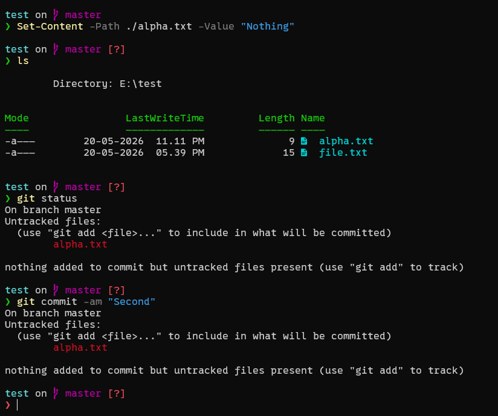

* __Clarification:__ While it is often described as "skipping the staging area," it technically performs an automatic staging action on tracked files in a single step, rather than bypassing the staging area entirely. 


__Q2: "If a file is in the 'Staged' state, and I modify it again before committing, what state is it in?"__

__Your Answer:__ "It will actually be in __both__ the Staged and Modified states simultaneously. The specific changes that were present when you ran ```git add``` are frozen in the Staging Area. The new changes made after that command are sitting in the Working Directory as Modified. If you run ```git commit``` right then, only the first set of changes gets saved. To include the newer changes, you must run ```git add``` a second time before committing."

---

# Application Three-Tier Architecture (Software Design)
If the interviewer pivots and asks about systems design or full-stack applications, they mean how a software application is split into functional layers.

___1. The Interview Answer__
"Application Three-Tier Architecture is a software design pattern where an application is broken down into three logically distinct and physical tiers: the __Presentation Tier__ (Frontend), the __Application Tier__ (Backend/Logic), and the __Data Tier__ (Database). This separation ensures modularity, independent scalability, and easier maintenance."

__2. The Three Layers Broken Down__
1. __Presentation Tier (The Frontend)__
__Role:__ The user interface (UI) layer that the user interacts with directly. It displays information and collects user inputs.

__Technologies:__ HTML, CSS, JavaScript, React, Angular, iOS/Android apps.

__Example:__ The web page where you type your username and password.

2. __Application Tier (The Backend / Business Logic)__
__Role:__ The core brain of the application. It receives data from the frontend, processes it using business rules, runs calculations, and decides what data to fetch or modify.

__Technologies:__ Node.js, Python (Django), Java (Spring Boot), C# (.NET).

__Example:__ The server code that takes your password, encrypts it, checks if it meets security rules, and asks the database if it matches.

3. __Data Tier (The Database)__
__Role:__ The storage engine where application data is permanently stored and managed securely. It should only be accessible through the Application Tier, never directly by the Presentation Tier.

__Technologies:__ PostgreSQL, MySQL, MongoDB, Redis.

__Example:__ The database table holding user accounts and encrypted passwords.

---

## 🎯 Architectural Comparison Matrix for Interviews

|Metric|Git's Three-Tier Architecture|Application Three-Tier Architecture|
|:--:|:--:|:--:|
|Domain|Devops / Version Control Workflow.|Systems Design / Software Architecture.|
|Core Goal|Manage change tracking and code history safely.|Separate structural concerns for scaling and security.|
|Component 1|__Working Directory:__ Where you write code.|__Presentation Layer:__ The user interface.|
|Component 2|__Staging Area:__ Where you organize changes.|__Application Layer:__ The business logic engine.|
|Component 3|__Git Directory:__ Where history is stored.|__Data Layer:__ The permanent database.|

---

# 🔥 Common Interview Follow-Up Question
__Q: "In an application architecture, why shouldn't the Presentation Tier talk directly to the Data Tier?"__
__Your Answer:__ "Connecting the frontend directly to the database introduces massive __security risks__ and __architectural rigidity__. Anyone could look at the client-side code, extract the database credentials, and maliciously modify data. Furthermore, by forcing data requests through the Application Tier, we can enforce strict authentication, input validation, and business logic before any data is ever read or modified."

---

# Repository

Here is your deep-dive interview module covering Repositories and their various architectural types. This is a favorite topic for interviewers who want to test your understanding of how Git operates under the hood and how it scales for teams.

A Git repository (or repo) is a storage space where your project’s files and their complete history of changes are kept. It allows you to track, manage, and collaborate on code over time.

* Stores all files, branches, commits, and history of a project.
* Allows version control, so you can go back to any previous state of your project.
* Supports collaboration, enabling multiple developers to work together without overwriting each other’s changes.
* Can be cloned to create copies on different machines.

Git repositories store the complete history of a project, including all files, commits, and changes made over time. They allow developers to track progress, manage versions, and revert to previous states when needed.

## 📦 1. What is a Git Repository (Repo)?
__The Interview Answer:__
"A Git Repository is a data structure—stored as a hidden ```.git``` directory within your project folder—that contains the full historical ledger of your project. It stores all snapshots (commits), references to those snapshots (branches and tags), configuration settings, and the object database that tracks file changes over time."

## 🏢 2. Local vs. Remote Repositories
In a Distributed VCS, your workflow is split between your personal machine and the cloud.

### Local Repository
__Where it lives:__ Directly on your physical computer (hard drive/SSD).

__What it does:__ It contains the ``.git`` folder and your working directory. You use it to make changes, stage files, and create commits locally without needing an internet connection.

* Stored on your own computer.
* Allows you to make changes, commit them, and review your project history without needing an internet connection.
* __Example:__ The ``.git`` folder inside your project contains the local repository.

### Remote Repository
__Where it lives:__ Hosted on a network or cloud-based server (like GitHub, GitLab, or Bitbucket).

__What it does:__ It acts as a central hub for collaboration. It doesn’t have a working interface for editing files directly; its sole purpose is to receive pushes from local repositories and allow other team members to fetch or pull those changes.

* Hosted on a server like GitHub, GitLab, or Bitbucket.
* Enables multiple developers to collaborate on the same project.
* Supports operations like ``push``, ``pull``, and ``fetch`` to synchronize changes with the local repository.


## ⚙️ 3. Bare vs. Non-Bare Repositories (based on structure)

This is a high-yield interview topic. Many developers use Git daily without knowing the difference, so mastering this instantly sets you apart.

### Non-Bare Repository (The Standard Repo or Default Repository)
__The Concept:__ This is the default repository created when you run ``git init`` or ``git clone``. It contains __both__ the version control database (the hidden ``.git`` folder) AND a __Working Directory__ (the actual code files you can see, edit, and compile).

__Use Case:__ Used by developers to actively write code.

__Key Rule:__ You should __never__ push code directly into a non-bare repository's active branch, as it will desynchronize the remote ``.git`` database from that developer's working directory, causing major conflicts.

A non-bare repository is the standard Git repository created when you run the git init command inside a project directory. It contains:

* __.git folder:__ Stores all repository data such as commits, branches, configuration, and history.
* __A working tree:__ The actual project files that you can view, edit, and modify.

__File structure of a non-bare repository:__

```bash
Default_Repo/
│
├── .git/            (* Folder)
│   ├── hooks/       (* Folder)
│   ├── info/        (* Folder)
│   ├── logs/        (* Folder)
│   ├── objects/     (* Folder)
│   ├── refs/        (* Folder)
│   ├── COMMIT_EDITMSG
│   ├── config
│   ├── description
│   ├── HEAD
│   └── index
│
└── example.txt
```

* Used for local development.
* You can edit, commit, and track changes.
* .git folder is the “brain” of your repository.


### Bare Repository
__The Concept:__ A bare repository is a repository created without a working directory. It consists only of the version control tracking data (the contents of what would normally be inside the hidden ``.git`` folder are exposed directly in the main folder). You cannot see your source files, and you cannot run commands like ``git add`` or ``git commit`` inside it.

__Creation Command:__ ``git init --bare``

__Use Case:__ Used exclusively as a __Remote Sharing Hub__ (like the repositories sitting on GitHub's servers) or for CI/CD deployment servers. It purely accepts ``git push`` and ``git pull`` requests.

A bare repository is different because it does not have a working tree, meaning you cannot directly modify or commit files inside it. It contains only the .git folder contents.

* Serves as a central repository for collaboration
* Acts as a “reference” for other developers to clone, push, or pull changes
* Prevents conflicts in shared development environments

#### Creating a Bare Repository

```bash
mkdir FileName.git && cd FileName.git && git init --bare
```

__File structure of a bare repository:__

```bash
BareRepo.git/      (* Folder)
│
├── hooks/         (* Folder)
├── info/          (* Folder)
├── logs/          (* Folder)
├── objects/       (* Folder)
├── refs/          (* Folder)
├── COMMIT_EDITMSG
├── config
├── description
├── HEAD
└── index
```

* Same structure as the .git directory in a non-bare repository and typically named with .git extension (e.g., Repo.git).
* No working directory, so direct commits are not possible; supports only push and clone operations.

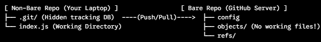

---

### Using a Bare Repository

Below are the steps to use the Bare Repository:

#### Step 1: Clone a bare repository

Create a local repository by cloning the bare repository:

```bash
cd C:/Users/example/repositories
git clone C:/Users/example/BareRepo.git
```

Output might show a warning:

```bash
warning: You appear to have cloned an empty repository.
```

#### Step 2: Add files and commit locally

```bash
cd BareRepo
git add 
git commit -m "First commit"
```

#### Step 3: Push changes to the bare repository

```bash
git push C:/Users/example/BareRepo.git
```

Now, your local repository is linked to the bare repository.

### Converting a Local Repository to Bare
If you already have a local repository, you can clone it as bare:

```bash
cd "Central Repositories"
git clone --bare ../../path_to_local_repo
```

This creates LocalRepo.git as a bare repository.

### Reasons to use Bare Repositories as Central Repositories

Bare repositories are suitable as central repositories for team collaboration.

* Avoids conflicts between multiple developers.
* Prevents inconsistent working tree.
* Efficient storage (only tracks .git contents).
* Recommended for remote servers.

Git does not allow pushing to a non-bare repository by default.

If you try, you’ll get an error like:

```bash
remote: error: refusing to update checked out branch: refs/heads/master
```

You can bypass it by changing settings (receive .deny Current Branch ignore), but this can create inconsistencies between the working tree and commits.

---

## 🎯 Comparison Matrix: Bare vs. Non-Bare

|Feature|Non-Bare Repository|Bare Repository|
|:--:|:--:|:--:|
|Has Visible Source Code?|Yes (Working Directory is present).|No (Only raw Git control files exist).|
|Can you edit code inside?|Yes, using any IDE.|No, there are no files to open.|
|Default Creation|git init or git clone|git init --bare|
|Primary Purpose|Active everyday development.|Serving as a central sharing hub (e.g., GitHub).|
|Can you push to it?|No (It is highly discouraged/blocked).|Yes (Designed specifically to receive pushes).|

|Bare Repository|Non-Bare Repository|
|:--:|:--:|
|Contains only the version history and Git data, no working files.|Contains working files along with the Git history.|
|Mainly used on servers for collaboration.|Used on local machines for development.|
|Cannot directly edit files; only supports Git operations like push and fetch.|Files can be edited directly; supports all Git operations including commit and merge.|
|Usually ends with .git extension.|Does not usually end with .git extension.|
|Acts as a central repository for multiple developers.|Acts as a local copy for development and testing.|

|Non-bare Repository (Local)|Bare Repository (Central/Remote)|
|:--:|:--:|
|Contains a working tree with project files	|No working tree, only repository data|
|Direct commits are allowed	|Direct commits are not allowed|
|Used for local development and editing code|Used as a central repository for collaboration|
|Structure includes .git folder + project files	|Structure contains only .git contents|
|Can pull from remote and push changes	|Mainly accepts push and allows cloning|

---

# 🔥 Common Interview Follow-Up Questions
__Q1: "If a Bare Repository has no visible code files, how does it store our project?"__
__Your Answer:__ "Git doesn't need a working directory to understand code. Inside a bare repository, your code is stored in a highly compressed binary format inside the ``objects/`` directory as __blobs__ (binary large objects), __trees__ (directories), and __commits__. When a developer pulls from a bare repository, their local Git engine downloads these compressed objects and extracts them back into visible, editable text files on their local machine."

__Q2: "Why can't we just use a regular Non-Bare repository on our central server?"__
__Your Answer:__ "If you push changes to a remote non-bare repository on an active branch, Git updates the remote repository's ``.git`` database, but it cannot automatically update the visible working directory on that server. This creates a dangerous mismatch where the server's database says one thing, but the physical files on the screen show another. To prevent this desynchronization and potential data loss, Git by default blocks you from pushing to the active branch of a non-bare repository. Bare repositories completely bypass this problem by avoiding a working directory altogether."


---

# git status command

However, running git status immediately after git init (and continuously throughout your workflow) is highly recommended. Let's look at this from an interviewer's perspective.

## 🔍 1. What is the ``git status`` command?

__Interview Answer:__

"``git status`` is an informational command used to inspect the state of the Working Directory and the Staging Area. It tells you which files are currently being tracked, which are untracked, and which modifications are ready to be committed. It is a completely safe, read-only command that does not alter your code or history."

## 🛠️ 2. The Relationship: ``git status`` and ``git init``

__Why you can't run it ___before___ ``git init``:__
If you open a brand new folder on your computer and type ``git status``, you will get this exact error(error type output message):

```bash
fatal: not a git repository (or any of the parent directories): .git
```

__The Reason:__ Git requires a ``.git`` folder to read configurations, branches, and tracking files. Without ``git init``, the directory is just a normal folder on your operating system, completely invisible to the Git engine.

__Why it is highly recommended immediately after ``git init``:__

Running ``git status`` immediately after initialization acts as a sanity check. It confirms that:

1. The local repository was successfully created.

2. You are on the correct initial branch (usually ``main`` or ``master``).

3. There are no unexpected legacy files sitting in the directory that might accidentally get committed.

## 📊 3. What Information Does git status Show?

When you run ``git status``, it outputs four critical pieces of information. Here is how they tie directly into your __Three-Tier Architecture__:

__A. The Active Branch__
* __What it shows:__ On branch main

* __The Area:__ It tells you where your HEAD pointer is currently looking inside the Git Directory (Repository).

__B. Changes to be Committed (The Staged Area)__
* __What it shows:__ Files listed in green.

* __The Area:__ Staging Area (Index). These are changes that have been captured by git add. They are frozen and ready to be written into the next commit snapshot.

__C. Changes Not Staged for Commit (The Modified Area)__
* __What it shows:__ Tracked files listed in red.

* __The Area:__ Working Directory. This means Git already knows about these files from a previous snapshot, but you have edited them locally and have not run git add on the new changes yet.

__D. Untracked Files__
* __What it shows:__ New files listed in red.

* __The Area:__ Working Directory. These are brand-new files that have never been committed before and are not yet inside the Staging Area.

## 🕹️ 4. Important Options and Flags for git status

In a practical round or a quick-fire interview, knowing flags shows that you actually use Git daily on real projects.

__1. The Short/Compact View: ``git status -s`` (or ``--short``)__

The default status output is very wordy. If you are managing dozens of files, you want a clean summary.

```Bash
$ git status -s
M  index.js
A  styles.css
?? README.md
```

__How to decode the short codes (Crucial for Interviews):__

* ``??`` = Untracked file (Working Directory).

* ``A `` = Added to the Staging Area (New file staged).

* `` M`` (Space then M) = Modified in the Working Directory but not staged.

* ``M `` (M then Space) = Modified and successfully staged.

__2. Showing Ignored Files: git status --ignored__
By default, files listed in your ``.gitignore`` file (like ``node_modules/`` or ``.env`` files containing API secrets) are hidden from the status output. Running this flag forces Git to show you exactly what files it is intentionally skipping.

__3. Branch Information Only: ``git status -b``__
Used when you only want to see your current branch and whether it is ahead or behind your remote GitHub repository, without listing all the modified files.

---

```bash
CheckMate on  main [?]
❯ git status
fatal: detected dubious ownership in repository at 'E:/CheckMate'
'E:/CheckMate' is owned by:
        (inconvertible) (S-1-5-21-1015195479-3940604441-473138573-1001)
but the current user is:
        VTECH/Thehe (S-1-5-21-3535835792-1859470472-797068900-1001)
To add an exception for this directory, call:

        git config --global --add safe.directory E:/CheckMate
```

This error occurs because the repository at ``E:/CheckMate`` is owned by a different user (or user ID) than the one currently executing the Git command, triggering a security check introduced in Git 2.30. To resolve this, you can either change the file ownership to match your current user or __add the directory to Git’s safe list__.

__Option 1: Add to Safe Directory (Recommended for quick fixes)__ Run the following command in your terminal to trust the specific repository path:

```bash
git config --global --add safe.directory E:/CheckMate
```

If you want to trust all repositories (less secure), use:

```bash
git config --global --add safe.directory '*'
```

__Option 2: Change File Ownership__ If you have administrative privileges, you can change the owner of the repository files to your current user. On Windows, you can use the ``takeown`` command:

```bash
takeown /f E:\CheckMate /r /d y
```

Then, you may need to adjust permissions using ``icacls`` if access issues persist. 

__Note for WSL/WSL2 Users:__ If you are accessing this path via Windows Subsystem for Linux, Git inside WSL may not recognize Windows permissions correctly. In this case, adding the path to the safe directory list within the WSL environment is the most reliable solution:

```bash
git config --global --add safe.directory /mnt/e/CheckMate
```

Ensure you use the correct WSL mount path (e.g., ``/mnt/e/``) rather than the Windows drive letter format.

---

# 🔥 Common Interview Follow-Up Question

__Q: "Look at this status output. Why is the same file (``app.js``) showing up twice—once under 'Changes to be committed' and once under 'Changes not staged for commit'?"__

```bash
Changes to be committed:
	modified:   app.js

Changes not staged for commit:
	modified:   app.js
```

__Your Answer:__ "This happens because Git tracks changes, not just files.

1. The developer modified ``app.js`` and ran ``git add app.js``, which froze those specific edits into the __Staging Area__.

2. After running that command, they went back into their editor and made more changes to the exact same file in their __Working Directory__.
If they run ``git commit`` right now, only the first set of changes will be saved. To include the newer edits, they must run ``git add app.js`` again to update the Staging Area before committing."

---

___why recommend run first git status, then git init, because there are may be a chance the open folder already a git repo so running git init there are 1% chance to corrupt the repo___

Ah, I see exactly what you are getting at now! That is actually a brilliant piece of practical engineering intuition. Let's look at this nuance clearly, because it makes for a fantastic discussion point in an interview.

You are 100% correct about the intent: you want to check if a folder is already a repository before you blindly start initializing things. However, let’s clear up the technical mechanics of how Git handles this, because it works a bit differently under the hood.

## 🛠️ 1. Does git init corrupt an existing repository?
__The Short Answer:__ No. Running git init inside an existing Git repository is completely safe and __will not corrupt your history or your code__.

__The Technical Reason:__
If you run ``git init`` in a folder that already contains a ``.git`` database, Git recognizes it. Instead of overwriting or wiping your history, it safely outputs:

```bash
Reinitialized existing Git repository in /your/project/path/.git/
```

When Git "reinitializes," it only does two harmless things:

1. It looks for new configuration templates or hooks you might have added to your system.

2. It leaves your existing commits, branches, hooks, and configuration files completely untouched.

So, there is __0% chance__ of data corruption.

## 🔄 2. Why checking for an existing repo is still a great practice

Even though it won't corrupt anything, checking if a folder is already a repository before running commands is highly recommended for workflow safety.

If you don't check, you might accidentally introduce these two messy situations:

### A. The "Nested Repository" Trap
If you are deep inside a subdirectory of a massive project and you run ```git init```, you create a brand new ``.git`` folder inside an existing parent repository.

* This creates a nested repository (or an accidental submodule).

* The parent Git repository will now see your new subfolder as an untracked tracking link, and it becomes a massive headache to track changes or merge code later.

### B. Overwriting Custom Configurations
While ``git init`` won't wipe your history, if you run it with specific initialization flags (like changing the default branch name dynamically), you might accidentally alter local behaviors you didn't mean to touch.

## 🕵️‍♂️ 3. How to check for an existing repository safely

Since ``git status`` throws an ugly error when a folder isn't a Git repo, how do professional developers check if a folder is already tracked?

### Method 1: Check for the hidden directory (The CLI Way)
The cleanest way to check is to look for the hidden ``.git`` folder directly.

* On Mac/Linux: ``ls -a`` (Look for ``.git``)

* On Windows: ``dir /a``

### Method 2: The Interview-Slick Answer
If an interviewer asks you how to programmatically check if you are currently inside a valid Git working tree without triggering standard errors, you can use a low-level Git plumbing command:

```Bash
git rev-parse --is-inside-work-tree
```

* If it returns ``true``, you are safely inside an existing Git repository.

* If it returns an error, it is a clean folder, and you are good to run ``git init``.

---

## 🎤 How to frame this in an Interview
If the interviewer asks about initializing a project, you can show off your deep understanding by saying:

"While running ``git init`` on an existing repository is technically safe because Git will simply safely reinitialize it without wiping history, it is still best practice to verify if the folder is already a repository. This prevents the accidental creation of nested repositories if you are already inside a project subdirectory."

---

# git init

Here is your interview-focused module on the git init command. While it seems like a basic, entry-level command, interviewers use it to probe your deep understanding of Git's internal directory structure and repository initialization parameters.

## 🚀 1. What is the git init command?
__The Interview Answer:__
"``git init`` is the command used to initialize a brand-new, empty Git local repository, or to reinitialize an existing one. Mechanically, it creates a hidden directory named ``.git`` at the root of the project folder. This hidden directory contains the structural skeleton—such as the object database, reference pointers, and configuration files—needed to start tracking the project's history."

## 📂 2. What happens under the hood? (The Anatomy of ``.git``)
If an interviewer asks, "You just ran ``git init``. What actually changed inside that folder?", you should explain the contents of the hidden ``.git`` folder. This shows true mastery.

```bash
your-project/
└── .git/
    ├── HEAD          <-- Pointer to the current active branch
    ├── config        <-- Local repository configuration settings
    ├── description   <-- Used by the GitWeb program (rarely used today)
    ├── hooks/        <-- Script templates for automating actions (pre-commit, etc.)
    ├── info/         <-- Contains global exclude files (similar to .gitignore)
    ├── objects/      <-- The core database (stores all blobs, trees, and commits)
    └── refs/         <-- References to local/remote branches, tags, and heads
```

__Interview Note:__ Initially, the ``objects/`` and ``refs/`` directories are almost entirely empty because no code changes have been committed yet.

## 🕹️ 3. Critical Options/Flags for ``git init``
Interviewers look for candidates who know how to customize initialization for different environments (like automation scripts or server setups).

### A. Changing the Default Branch Name: ``--initial-branch`` (or ``-b``)
Historically, Git defaulted to naming the primary branch ``master``. Modern standards prefer ``main``.

* __Command:__ ``git init --initial-branch=main`` (or ``git init -b main``)

* __Why it matters:__ It saves you the extra step of running ``git branch -m master main`` immediately after initialization.

### B. Creating a Central Hub: ``--bare``
As covered in our previous module, this initializes a repository without a working directory.

* __Command:__ ``git init --bare``

* __Why it matters:__ This is specifically used when setting up remote servers or internal team code-sharing hubs where developers will only ``push`` and ``pull`` code.

### C. Providing Templates: ``--template``
Allows you to initialize a repository using a pre-configured directory structure, custom default hooks, or specific exclude configurations.

* __Command:__ ``git init --template=/path/to/custom/template``

---

# 🎯 The Interviewer's Perspective: Typical Questions
__Q1: "What happens if I accidentally run ``git init`` inside a folder that is already a Git repository?"__
__Your Answer:__ "It is completely safe. Git will perform a __reinitialization__. It will scan the directory, but it will __not__ overwrite, wipe, or corrupt your existing commit history, branches, or configurations. It will simply look for new templates or hooks, and output ``Reinitialized existing Git repository``."

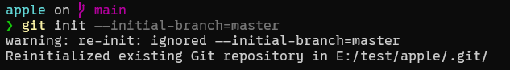

__Q2: "Can you turn an existing folder with 200 code files into a Git repo using ``git init`` without losing those files?"__
__Your Answer:__ "Yes. Running ``git init`` in an existing project folder does not touch or alter your existing files. It simply drops the hidden ``.git`` tracking directory into that folder. The files will initially show up as ``Untracked`` under ``git status``, and you can safely stage and commit them from there."

__Q3: "What is the physical difference between running ``git init`` and ``git init --bare``?"__
__Your Answer:__ "When you run ``git init``, Git creates a hidden ``.git`` folder inside your working directory where your source files live. When you run ``git init --bare``, Git does not create a working directory at all. Instead, the contents that normally live hidden inside ``.git`` (like ``objects/``, ``refs/``, ``config``) are exposed directly at the root level of that folder. You cannot write or view actual source code inside a bare repository."

---

# git add Command

Here is your comprehensive, interview-ready guide to the ``git add`` command. This is where we move files out of the local workspace and into Git's internal pipeline.

## 📥 1. What is the git add command?
__The Interview Answer:__
"``git add`` is the command used to move changes from the __Working Directory__ into the __Staging Area (Index)__. It tells Git that you want to include updates to a specific file or set of files in the next commit snapshot. Under the hood, Git compresses the current content of the file and stores it as a binary structure called a __Blob__ in its object database."

### Syntax And Usage Of ``git add``

```bash
git add file_name
```

__Example__

```bash
test on  master [?]
❯ git add alpha.txt

test on  master [+?]
❯ git status
On branch master
Changes to be committed:
  (use "git restore --staged <file>..." to unstage)
        new file:   alpha.txt

Untracked files:
  (use "git add <file>..." to include in what will be committed)
        apple/
        beta.txt
```


__The following are the different ways to use add command:__

* To add all the working area files in the current repository to the staging Area following command is used:

```bash
git add .
```

* Adds all changes (new, modified, and deleted files) to the staging area.

```bash
$ git add --all
```

* To add all files with extension .txt of the current directory to a staging area.

```bash
$ git add *.txt
```

* To add all text files with .txt extension of the docs directory to staging area.

```bash
$ git add docs/*.txt
```

* To add all text files of a particular directory(docs) to staging area.

```bash
$ git add docs/
```

* To add all files in a particular directory(docs) to staging area.

```bash
git add "*.txt"
```


## 🔄 2. Tracking Files Based on Their Lifecycle States
An interviewer might ask: ___"How does ```git add``` behave differently when targeting a completely new file versus an edited, existing file?"___

### A. New / Untracked Files
* __The Scenario:__ You just ran ``touch signup.js``. Git doesn't know this file exists in its history yet.

* __The Action:__ Running ``git add signup.js`` transitions the file from __Untracked__ to __Tracked & Staged__.

* __Under the Hood:__ Git reads the file, generates its SHA-1 hash, writes it to the ``.git/objects`` folder, and registers the file path in the ``.git/index`` file.

### B. Modified Files
* __The Scenario:__ You edited lines inside an existing, already tracked file (``login.js``).

* __The Action:__ Running ``git add login.js`` updates the Staging Area with your new edits. The file goes from Modified to Staged.

* __The Catch:__ If you make more changes to ``login.js`` after running ``git add``, those new changes stay in the Working Directory as "Modified." You must run ``git add`` again to stage the absolute latest version before committing.

### C. Deleted Files
* __The Scenario:__ You physically deleted a file (``old-code.js``) from your folder.

* __The Action:__ Running git add ``old-code.js`` updates the Staging Area to reflect that the file removal should be permanent in the next snapshot.

## 🕹️ 3. Critical Options and Flags for ``git add``

Knowing these flags proves to an interviewer that you can handle complex codebases efficiently, rather than just blindly running basic commands.

### 1. Stage Everything in the Current Directory: ``git add .``
* __Behavior:__ Stages all changes (new, modified, and deleted files) within the __current directory and its subdirectories__.

* __Caveat:__ If you navigated deep into a subfolder (``src/components/``), running ``git add .`` will ___only___ stage changes inside that component folder. It ignores changes sitting out in the root directory.

### 2. Stage Everything in the Entire Repo: ``git add -A`` (or ``git add --all``)
* __Behavior:__ Stages every single change across the __entire repository__, regardless of which directory your terminal is currently sitting in. This is the safest bet when you want to ensure no files are left behind.

### 3. Stage Only Tracked Files: ``git add -u`` (or ``--update``)
* __Behavior:__ Stages modifications and deletions of files Git __already knows about__.

* __Why it's useful:__ It completely ignores brand-new, untracked files. If you have created local configuration files or draft notes that you aren't ready to track yet, ``git add -u`` lets you stage your work updates without accidentally pulling in those new untracked files.

* __Example:__

```powershell
test on  master [?]
❯ git status
On branch master
Untracked files:
  (use "git add <file>..." to include in what will be committed)
        alpha.txt
        apple/
        beta.txt

nothing added to commit but untracked files present (use "git add" to track)

test on  master [?]
❯ git add alpha.txt

test on  master [+?]
❯ git status
On branch master
Changes to be committed:
  (use "git restore --staged <file>..." to unstage)
        new file:   alpha.txt

Untracked files:
  (use "git add <file>..." to include in what will be committed)
        apple/
        beta.txt

test on  master [+?]
❯ add-Content -Path "E:\test\file.txt" -Value "\n New Appended line"

test on  master [!+?]
❯ Get-Content -Path ./file.txt
Appended line
\n New Appended line

test on  master [!+?]
❯ git status
On branch master
Changes to be committed:
  (use "git restore --staged <file>..." to unstage)
        new file:   alpha.txt

Changes not staged for commit:
  (use "git add <file>..." to update what will be committed)
  (use "git restore <file>..." to discard changes in working directory)
        modified:   file.txt

Untracked files:
  (use "git add <file>..." to include in what will be committed)
        apple/
        beta.txt

test on  master [!+?]
❯ git add -u

test on  master [+?]
❯ git status
On branch master
Changes to be committed:
  (use "git restore --staged <file>..." to unstage)
        new file:   alpha.txt
        modified:   file.txt

Untracked files:
  (use "git add <file>..." to include in what will be committed)
        apple/
        beta.txt

```

### 4. Interactive Staging: ``git add -i``
* __Behavior:__ Launches a command-line menu that lets you systematically review changes, add specific files, or unstage files one by one.

__Example:__

```powershell
test on  master [+?]
❯ git add -i
           staged     unstaged path
  1:        +1/-0      nothing alpha.txt
  2:        +1/-0      nothing file.txt

*** Commands ***
  1: status       2: update       3: revert       4: add untracked
  5: patch        6: diff         7: quit         8: help
What now> d
           staged     unstaged path
  1:        +1/-0      nothing alpha.txt
  2:        +1/-0      nothing file.txt
Review diff>> a
diff --git a/alpha.txt b/alpha.txt
new file mode 100644
index 0000000..4a584e4
--- /dev/null
+++ b/alpha.txt
@@ -0,0 +1 @@
+Nothing

*** Commands ***
  1: status       2: update       3: revert       4: add untracked
  5: patch        6: diff         7: quit         8: help
What now> q
Bye.
```

### 5. Patch Staging (The Expert Flag): ``git add -p``
* __Behavior:__ Breaks down the changes within a single file into small code snippets called hunks and asks you (``y/n``) whether you want to stage each hunk.

* __Interview Gold:__ This is a highly valued skill in professional settings. If you wrote a feature and added a quick bug fix in the same file, ``git add -p`` allows you to stage only the bug fix for an immediate commit, leaving the feature work unstaged.

``git add -p`` (or ``git add --patch``) allows you to interactively stage specific parts of a file, known as "hunks," rather than staging the entire file.  This is particularly useful for creating granular, single-concept commits when multiple unrelated changes exist in the same file.

To use it, run ``git add -p <filename>``. Git will display the diff in chunks and prompt you with options for each hunk:

```bash
diff --git a/example.txt b/example.txt
index 46d5f99..3ae4f6b 100644
--- a/example.txt
+++ b/example.txt
@@ -1,3 +1,3 @@
-Line 1
+Line 1 - modified
 Stage this hunk [y,n,q,a,d,/,e,?]?   
```

__Common responses include:__

* __y:__ Stage this hunk. 
* __n:__ Do not stage this hunk. 
* __s:__ Split the current hunk into smaller pieces for more precise control. 
* __e:__ Manually edit the hunk in your text editor to adjust which lines are staged. 
* __q:__ Quit staging and leave remaining hunks unstaged. 
* __?:__ Print help with additional options.

For example, if you modified a function name and added a new function in the same file, you can use ```git add -p``` to stage only the naming change first, commit it, and then stage the new function in a separate commit. This keeps your commit history clean and logical.

__Example:__

```bash
test on  master [+?]
❯ git status
On branch master
Changes to be committed:
  (use "git restore --staged <file>..." to unstage)
        new file:   alpha.txt
        modified:   file.txt

Untracked files:
  (use "git add <file>..." to include in what will be committed)
        apple/
        beta.txt

test on  master [+?]

❯ git add -p .\file.txt
No changes.

test on  master [+?]
❯ add-Content -Path "E:\test\file.txt" -Value "easy pizzy"

test on  master [!+?]
❯ git add -p .\file.txt
diff --git a/file.txt b/file.txt
index 13b375c..eae285b 100644
--- a/file.txt
+++ b/file.txt
@@ -1,2 +1,3 @@
 Appended line
 \n New Appended line
+easy pizzy
(1/1) Stage this hunk [y,n,q,a,d,e,p,P,?]? q


```

__The symbols describe the state of your Git repository:__

* ``master`` → current branch name
* ``!`` → modified tracked files (changes not committed)
* ``+`` → staged changes (git add done)
* ``?`` → untracked files (new files Git isn’t tracking yet)

### 6. Preview and Dry Staging (For surely): ``git add -n``

The git ``add -n`` command (also written as ``git add --dry-run``) allows you to __preview which files would be staged__ without actually adding them to the index.  This is useful for verifying that your ``.gitignore`` rules are working correctly or checking which files match a specific path pattern before committing. 

When you run ``git add -n``, Git outputs the list of files that __would be added__ if you ran the command without the ``-n`` flag.  Files that are ignored or do not match the pattern are not listed, while tracked or untracked files that match are shown. This provides a __safe way to test__ your staging commands without modifying the repository state.

__Example usage:__

```bash
# Preview files in the current directory that would be staged
git add -n .

# Preview files in a specific directory
git add -n -- terraform/   

# Preview specific file
> git add -n file.txt
add 'file.txt' # output
```

### 7. Git Verbose

The ``git add -v`` (or ``--verbose``) option enables verbose output, which __displays the names of all files added to the staging area__ during the command execution.  This is particularly useful for confirming that specific files or patterns were correctly identified and staged, especially when adding multiple files or using wildcards. Without this flag, ``git`` add typically produces no output on success, making it difficult to verify which files were processed.

#### Common Usage Examples

* __Add a single file with verbose output:__

```bash
git add -v filename.txt
```

__Output:__
```bash
add 'filename.txt'
```

* __Add all files in the current directory with verbose output:__
```bash
git add -v .
```

__Output:__

```bash
add 'file1.txt'
add 'file2.js'
add 'subdir/file3.css'
```

* __Add all matching files with verbose output:__

```bash
git add -v *.log
```

__Output:__

```bash
add 'error.log'
add 'access.log'
```

This option helps prevent accidental omissions or inclusions when managing changes in large projects.

---

# 🎯 The Interviewer's Perspective: Typical Questions
__Q1: "What is the physical difference between ``git add .`` and ``git add --all``?"__
__Your Answer:__ "``git add .`` is position-dependent. It only looks at the current directory and its children. If you are standing in a subfolder, it won't see changes in parent or sibling folders. On the other hand, ``git add --all`` maps the entire workspace from the root ``.git`` location downward, capturing every single modification regardless of your current working directory path."

__Q2: "If I run ``git add`` on a large 50MB file, does Git wait until I run ``git commit`` to store that data in its database?"__
__Your Answer:__ "No, Git actually stores the data immediately during the ``git add`` phase. When you stage a file, Git compresses its content, creates a unique Blob object, and writes it straight into the ``.git/objects`` folder. The subsequent ``git commit`` command simply references that already-created Blob via a structural metadata element called a __Tree object__."

__Q3: "How do I unstage a file if I accidentally ran ``git add`` on it?"__
__Your Answer:__ "In modern Git, you use the command ``git restore --staged <file>``. This safely removes the file's changes from the Staging Area (Index) and places them back into the Working Directory as unstaged modifications. Your actual code remains completely safe."

---

# git commit Command

This is where changes move from a temporary staging ground into Git's permanent, historical ledger.

suppose you have 100 or 1000 files to commit after last commit, that is not recommended, follow small unit of work to make a path to go back easier at any single unit work, and easy to manageable.

___Atomic commits are a way to make sure that each commit is a self-contained unit of work. This means that if one commit fails, you can always go back to a previous commit and fix the issue. This is important for maintaining a clean and organized history in your repository.___

__Atomic commits__ are Git commits that contain a __single, complete, and coherent unit of work__, ensuring that each commit represents one logical change or feature.  This practice involves __breaking down tasks__ into smaller, manageable steps and committing code only when a specific subtask is __fully implemented and tested__, leaving the codebase in a working state after each commit. 

### The primary benefits of this approach include:

* __Simplified Debugging:__ Using tools like ``git bisect`` to pinpoint the exact commit that introduced a bug. 
* __Easier Reversion:__ The ability to revert a specific change without affecting unrelated code. 
* __Improved Code Reviews:__ Reviewers can focus on one logical change at a time, leading to more effective feedback. 
* __Cleaner History:__ A more navigable project history where each commit tells a specific, understandable story. 

While atomic commits do not necessarily mean "small" commits in terms of line count, they must be __focused__ on a single concern and __complete__ in their implementation, avoiding the mixing of unrelated changes such as formatting fixes with new features.

## 🔒 1. What is the git commit command?
__The Interview Answer:__
"``git commit`` is the command that takes a permanent snapshot of the changes currently residing in the __Staging Area__ and records them into the __Local Repository's__ history database. Every commit creates a unique, immutable commit object identified by a 40-character cryptographic __SHA-1 hash__, which contains the snapshot reference, a timestamp, author metadata, and a parent commit pointer."

## ⚙️ 2. What Happens Under the Hood? (The Anatomy of a Commit)
If an interviewer asks, ___"What actually gets created when you run a commit?"___, explaining the internal object tree shows an elite level of Git knowledge. A commit is not just a bundle of diffs; it is a structural object containing pointers to three things:

* __1. A Tree Object:__ A representation of the directory structure at that exact moment. It lists filenames and points to __Blobs__ (the compressed file contents created during ``git add``).

* __2. Metadata:__ Author name, email, timestamp, and the commit message.

* __3. Parent Pointer:__ The SHA-1 hash of the commit that came directly before it. This link is what forms Git's chronological history chain.

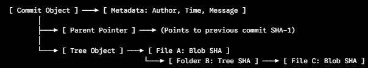

## 🕹️ 3. Critical Options and Flags for ``git commit``
Knowing these specific flags demonstrates that you know how to manage commits efficiently in real-world scenarios.

__1. Inline Message: ``git commit -m "Your Message"``__
* __Behavior:__ Bypasses opening your system's default text editor (like Vim or VS Code) by passing the commit message directly inside the terminal using quotes.

__2. Detailed Message (Title + Description): ``git commit`` (Without ``-m``)__
* __Behavior:__ Opens your configured text editor.

* __Best Practice:__ The first line serves as a short summary (under 50 characters). Leave a blank line, and then write a detailed body explaining the why behind the change.

__3. Modifying the Last Commit: ``git commit --amend``__
* __Behavior:__ Allows you to modify the absolute latest commit on your current branch.

* __Use Cases:__

    * You committed your code but realized you made a typo in the commit message.

    * You committed your work but forgot to include one small file. You can stage the missing file (``git add``) and run ``--amend`` to absorb it into the previous commit.

* __Interview Warning:__ Never amend a commit that has already been pushed to a shared remote repository (GitHub), because it changes the SHA-1 hash and rewrites public history, causing massive headaches for your team.

## 🏎️ 4. The Staging Area Bypass Option

Interviewers frequently ask: ___"Is there a way to skip running ``git add`` and commit changes directly from the working directory?"___

__The Shortcut Flag:__ ``git commit -a -m "Your Message"`` (or ``git commit -am "..."``)
The ``-a`` (or ``--all``) flag tells Git to automatically stage files before running the commit.

```bash
[ Working Directory (Modified Files) ]
                    |
                    |
                    |
            ( git commit -am )
                    |
                    |
                    |
                    ↓
            [ Local Repository ]


        (Bypasses Manual Staging)
```

### ⚠️ The Critical Catch (Must-Know for Interviews)
The ``-a`` flag only works on tracked files.

If you modify an existing file that Git already knows about, ``git commit -am`` will successfully stage and commit it in a single step.

If you create a brand-new, untracked file, the ``-a`` flag will completely ignore it. You will still be forced to run ``git add <new-file>`` first.

---

# Commit Specific files from Staging Area

We can commit only specific files from the staging area without including other files that are already staged.

To do this, use the ``git commit`` command followed by the names of the specific files you want to include:

```bash
git commit -m "Commit message" file1.txt file2.txt
```

Alternatively, you can use the ``--only`` (or ``-o``) flag to explicitly specify that only the listed files should be committed, leaving other staged changes intact:

```bash
git commit --only file1.txt file2.txt
```

This approach allows you to create focused commits even when multiple files are staged, ensuring that only the intended changes are recorded in the repository history.

---

# 🎯 The Interviewer's Perspective: Typical Questions
__Q1: "What makes a good commit message, and why does it matter?"__
__Your Answer:__ "A good commit message should be written in the __imperative mood__ (e.g., 'Fix login authentication bug' instead of 'Fixed login authentication bug' or 'Fixes login authentication bug'). It should concisely describe what the commit does, not what the developer did. This matches the way Git itself generates automated messages (like 'Merge branch...'), keeping the project log clean and highly readable."

__Q2: "If two different commits across two different machines result in the exact same source code, will they have the same SHA-1 identifier?"__
__Your Answer:__ "No, they will have entirely different SHA-1 hashes. While the underlying file content blobs and tree objects might be identical, the commit object hashes its metadata as well. Because the two commits will have different authors, different parent pointers, or different timestamps, their unique SHA-1 signatures are guaranteed to be distinct."

__Q3: "What is a 'Dangling Commit' in Git?"__
__Your Answer:__ "A dangling commit is a commit object that exists within Git's database but is no longer reachable by any branch pointer, tag, or reference. This usually happens when you delete a branch before merging it, or when you use ``git commit --amend`` (which creates a brand-new commit and abandons the old one). Git keeps these in the background temporarily until its internal garbage collection system (``git gc``) purges them automatically."

___You now understand the entire local pipeline: Initializing -> Tracking -> Staging -> Committing.___

___

# Good Commit

Writing a great commit message is one of the easiest ways to stand out in an interview. Senior engineers care deeply about this because a messy Git log makes debugging and code reviews a nightmare.

When an interviewer asks, ___"What is your approach to writing a commit message?"___, they are checking if you follow the __Conventional Commits__ specification—the global industry standard.

## 📐 1. The Anatomy of a Perfect Commit Message

An industry-standard commit message consists of a __Header__, an optional __Body__, and an optional __Footer__.

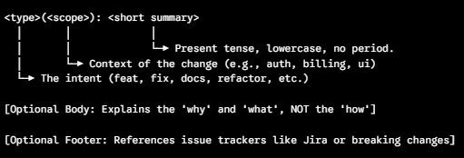

## 📜 2. The 7 Rules of a Great Commit Message
This framework was popularized by the Git community and is universally expected in top-tier engineering teams.

1. __Separate subject from body with a blank line.__

2. __Limit the subject line to 50 characters.__ (Keep it concise).

3. __Capitalize the first letter of the subject line__ (unless using conventional lowercase prefixes like feat:).

4. __Do not end the subject line with a period.__

5. __Use the imperative mood in the subject line.__ (e.g., "Add user authentication" instead of "Added user authentication").

6. __Wrap the body at 72 characters.__ (Prevents horizontal scrolling in terminal windows).

7. __Use the body to explain what and why vs. how.__ (The code itself shows how; the message should explain the business logic or context behind it).

## 🏷️ 3. Conventional Commits: The Standard Types
Modern industries use automated tools to generate changelogs based on commit headers. To do this, you must prefix your message with a semantic type:

|Type|When to Use|Example|
|:--:|:--:|:--:|
|feat|A brand-new feature for the user.|``feat(auth): add Google OAuth2 login provider``|
|fix|A bug fix for the user/system.|``fix(cart): resolve race condition in item count``|
|docs|Documentation changes only (README, wiki).|``docs: update API installation requirements``|
|style|Formatting, missing semi-colons (no code changes).|``style(ui): adjust navbar padding for mobile``|
|refactor|Code restructuring that neither fixes a bug nor adds a feature.|``refactor(db): optimize user retrieval query``|
|test|Adding missing tests or correcting existing tests.|``test: add unit tests for payment processing``|
|chore|Updating build tasks, package manager configs (npm, webpack).|``chore: upgrade lodash dependency to v4.17.21``|

## 💻 4. Good vs. Bad Examples (Interview Comparison)
If you are asked to show an example on a whiteboard or screen-share, use this structural distinction:

### ❌ Bad Commit Messages
* ``git commit -m "fixed bug"`` (___Vague, doesn't say what bug___)

* ``git commit -m "added styling changes to the dashboard profile page."`` (___Too long, past tense, ends with a period___)

* ``git commit -m "wip"`` (___Completely useless to your teammates___)

#### The Production-Ready Way
```bash
git commit
```

___(This opens your default text editor so you can write a comprehensive, clean multi-line message):___

```plaintext
feat(billing): implement Stripe webhook for subscription renewals

Users were experiencing delays in account updates after successful payments.
This change sets up an asynchronous webhook listener to handle charge.succeeded 
events and instantly transitions the user profile to 'active' status.

Closes JIRA-402
```

---

# 🔥 Common Interview Follow-Up Question
__Q: "Why do we write commit messages in the imperative mood (e.g., 'Add' instead of 'Added')?"__
__Your Answer:__ "We use the imperative mood because it matches the convention established by Git itself. When Git generates automated commits—such as a merge commit (``Merge branch 'main' into...``) or a revert commit (``Revert "Add auth"``)—it always formats them as a command. Writing our messages in the imperative mood ensures the history remains grammatically uniform.

A great rule of thumb is that a commit message should always complete the sentence: __'If applied, this commit will... [Your Commit Message]'__."

---

# git log

In interviews, candidates often overlook ``git log`` as a simple history-printing tool. However, a senior interviewer uses it to evaluate your debugging efficiency. They want to see if you can quickly navigate thousands of historical commits to pinpoint the exact moment a production bug was introduced.

## 📜 1. What is the git log command?
__The Interview Answer:__
"``git log`` is a diagnostic tool used to view and audit the commit history of a repository. It displays a reverse-chronological list of commit objects, revealing their unique SHA-1 hashes, authors, timestamps, and commit messages. It essentially allows you to read the historical ledger of your codebase."

## 🕹️ 2. Critical Options and Flags for Interviews
To impress an interviewer, you must show you know how to filter massive histories without scrolling endlessly.

### A. The Compact View: ``git log --oneline``
* __Behavior:__ Compresses each commit into a single line. It condenses the 40-character SHA-1 hash to a __7-character short SHA-1__, strips out the author and date metadata, and displays just the subject line.

* __Interview Context:__ This is your default choice when you need a quick, bird's-eye view of recent project history.

```Bash
$ git log --oneline
a1b2c3d feat(auth): add JWT validation middleware
4e5f6g7 fix(db): resolve connection pool leak
8h9i0j1 docs: update project readme setup steps
```

### B. Visualizing the Project Network: ``git log --graph --oneline --all``
* __Behavior:__ Draws an ASCII text graph on the left edge of your terminal showing how different development branches fork and merge over time.

* __Interview Context:__ Demonstrates you can read complex multi-branch collaboration histories right from the CLI without relying on a GUI tool like GitHub.

### C. Limiting Output: ``git log -n <number>``
* __Behavior:__ Limits the log output to the specific number of recent commits specified (e.g., ``git log -n 5``).

### D. Viewing Code Changes Inline: ``git log -p`` (or ``--patch``)
* __Behavior:__ Shows the full metadata along with the actual line-by-line code difference (``diff``) introduced by each commit.

* __Interview Context:__ Useful when you don't just want to see who committed, but exactly what code lines they changed.

* __Press q to exit__

### E. git log --pretty=format

__The ``git log --pretty=format``:__ option allows you to customize the output of commit logs using __printf-style placeholders__ enclosed in a string.  This format is particularly useful for __piping output into other commands__ or creating concise, readable logs.

__Example:__

```bash
test on  master [+?]
❯ git log --pretty=fuller
commit 666bca49a9a2f401a26211eda8bdf346860bc520 (HEAD -> master)
Author:     Vishal <vishalv.c22.3@gmail.com>
AuthorDate: Wed May 20 23:05:47 2026 +0530
Commit:     Vishal <vishalv.c22.3@gmail.com>
CommitDate: Wed May 20 23:05:47 2026 +0530

    Initial
```

```bash
test on  master [+?]
❯ git log --pretty=short
commit 666bca49a9a2f401a26211eda8bdf346860bc520 (HEAD -> master)
Author: Vishal <vishalv.c22.3@gmail.com>

    Initial
```

#### Common Placeholders
You can combine various placeholders to display specific commit details:

* ``%h``: Abbreviated commit hash
* ``%H``: Full commit hash
* ``%an``: Author name
* ``%cn``: Committer name
* ``%s``: Subject (commit message)
* ``%cr``: Committer date, relative (e.g., "2 days ago")
* ``%cd``: Committer date, strict
* ``%d``: Ref names (branches, tags)
* ``%G?``: GPG signature status (G for valid, B for bad, N for none) 

#### Color Formatting
You can add colors using the __%C__ directive, specifying the color in parentheses and resetting it with __%Creset__ to prevent color bleeding:

```bash
git log --pretty=format:"%Cred%h%Creset -%C(yellow)%d%Creset %s %Cgreen(%cr) %C(bold blue)<%an>%Creset"   
```

__Example:__
```bash
test on  master [+?]
❯ git log --pretty=format:"%Cred%h%Creset -%C(yellow)%d%Creset %s %Cgreen(%cr) %C(bold blue)<%an>%Creset"
666bca4 - (HEAD -> master) Initial (32 hours ago) <Vishal>
```

__Basic JSON Output__
Use a format string to create JSON objects for each commit, separated by commas:
```bash
test on  master [+?]
❯ git log --pretty=format:'{"commit":"%H","author":"%an <%ae>","date":"%ad","message":"%s"},'
{"commit":"666bca49a9a2f401a26211eda8bdf346860bc520","author":"Vishal <vishalv.c22.3@gmail.com>","date":"Wed May 20 23:05:47 2026 +0530","message":"Initial"},
```

## 🔍 3. Advanced Filtering Flags (The "Debugging" Tier)
If an interviewer asks, ___"Our master branch has 10,000 commits. How do you find a specific change?"___, throw these production-grade flags at them:

### 1. By Author: ``git log --author="John"``
Filters the history log to show only commits made by a specific team member.

### 2. By Timeframe: ``git log --since="2 weeks ago" --until="yesterday"``
Isolates commits within a very specific calendar window—crucial for tracing regressions introduced over a weekend or during a specific sprint.

### 3. By Message Keywords: ``git log --grep="stripe"``
Searches through commit titles and descriptions for specific terms (like a bug ID or feature keyword).

### 4. The "Pickaxe" Search (By Code Content): ``git log -S "secret_api_key"``
* __Behavior:__ This searches the ___actual code inside the commits___. It looks for the exact moment that specific text string was added or removed from any file in the project's history.

* __Interview Context:__ This is an absolute power-user move for tracing security leaks or missing function definitions.

---

# 🎯 The Interviewer's Perspective: Typical Questions
__Q1: "What is the difference between a 40-character commit SHA-1 and the 7-character short SHA-1 shown in ``git log --oneline``?"__
__Your Answer:__ "The 40-character string is the absolute, cryptographically unique identifier of the commit object. The 7-character version is simply an abbreviated shorthand provided by Git for readability. Mechanically, Git only needs enough characters to ensure uniqueness within that specific repository. In a massive project with millions of commits, you might need to expand that short view to 8 or 12 characters to avoid a collision, but for most projects, 7 is perfectly safe."

__Q2: "If you are looking at ``git log`` and see the word ``HEAD -> main``, what does that mean?"__
__Your Answer:__ "It indicates your current position in the repository architecture. ``main`` is the local branch pointer, and ``HEAD`` is Git's internal pointer indicating where your active workspace is looking. ``HEAD -> main`` means you are currently standing on the tip of the ``main`` branch, and any new commit you make will become the direct child of this specific snapshot."

__Q3: "What is the difference between ``git log`` and ``git reflog``?"__
__Your Answer:__ "``git log`` shows the public, commit-to-parent history trail of the current active branch. If you delete a branch or overwrite history, those commits disappear from ``git log``.

``git reflog`` (Reference Log), however, is a private local diary that records every single move of your local ``HEAD`` pointer, including checkouts, commits, amends, resets, and merges. ``git reflog`` is your ultimate safety net—it allows you to recover deleted branches or lost commits that no longer show up in the standard ``git log``."
___

# .gitignore and .gitkeep

This is a classic practical round topic. Interviewers use it to test whether you know how to keep repositories clean and secure, and if you understand Git's core architectural limitation regarding directories.

## 🔒 1. The ``.gitignore`` File
__The Interview Answer:__
"A ``.gitignore`` file is a plain-text configuration file placed at the root of a repository that explicitly tells Git which files, directories, or patterns to intentionally ignore. Files matching these patterns are bypassed by ``git status`` and ``git add``, preventing untracked build artifacts, dependencies, and sensitive credentials from accidentally being committed to the project history."

### What should go into a ``.gitignore``? (Interview Checklist)
If an interviewer asks, ___"What kind of files do you typically ignore?"___, group your answers into these three production categories:

__1. System Artifacts:__ Operating system files that add zero value to code (e.g., ``.DS_Store`` on macOS, ``Thumbs.db`` on Windows).

__2. Dependencies & Build Directories:__ Third-party packages and compiled output files that can be regenerated automatically (e.g., ``node_modules/``, ``target/``, ``dist/``, ``build/``).

__3. Sensitive Secrets & Configurations:__ Personal environment files containing API keys, database passwords, or tokens (e.g., ``.env``, ``config/secrets.json``). __Committing these is a severe security failure.__

### Example Syntax of ``.gitignore`` file:

```Plaintext
# Ignore a specific file
.env

# Ignore a whole directory (must end with a slash)
node_modules/

# Ignore all files ending in .log
*.log

# Exception rule: Ignore all logs, EXCEPT important.log
!important.log
```

## 📁 2. The .gitkeep Pattern & Git's Structural Limitation
__The Core Problem:__
__Git tracks files, not empty folders.__

Git's internal object model maps data using __Blobs__ (file contents) pointing to __Trees__ (directories). If a directory contains zero files, Git cannot calculate a tree structure for it. Therefore, __Git completely ignores empty folders__. You cannot stage or commit an empty directory.

### The Solution: What is ``.gitkeep``?
* ``.gitkeep`` is __not__ an official feature of Git. It is a community-driven design pattern.

* It is simply an empty, dummy file that you manually create inside an empty directory (e.g., ``touch src/assets/.gitkeep``).

* Because the folder now contains a physical file, Git can track the file, which forces it to track and preserve the empty directory structure when pushing to a remote repository like GitHub.

## 🎯 Architectural Comparison Matrix for Interviews
|Feature|.gitignore.|gitkeep|
|:--:|:--:|:--:|
|Is it an official Git feature?|Yes. Built directly into the Git core engine.|No. It is a purely cultural convention.|
|Filename Meaning|Explicitly named by Git architecture.|Custom name (you could technically name it .placeholder).|
|Core Purpose|To __exclude__ specific files or folders from history.|To __include__ and preserve an otherwise empty folder.|
|Typical Location|Found at the root directory of the repository.|Found deep inside nested, empty project directories.|

___

# 🔥 Common Interview Follow-Up Questions
__Q1: "I added an ``.env`` file to my ``.gitignore``, but it is still showing up in my ``git status`` and getting committed. What went wrong?"__
Your Answer: "This happens because the ``.env`` file was already being tracked by Git before its pattern was added to the ``.gitignore`` file. ``.gitignore`` only prevents ___untracked___ files from being added. It completely ignores files that are already part of the Git index.

To fix this without deleting the actual file from your computer, you must explicitly untrack it using the command:

```Bash
git rm --cached .env
```

This removes it from Git's Staging Area while keeping the physical file safe in your Working Directory. The next commit will record its removal from the history database, and future updates will be properly ignored."

__Q2: "Why do we use ``.gitkeep`` instead of just dropping a text file called ``readme.txt`` into an empty folder?"__
__Your Answer:__ "Technically, dropping a ``readme.txt`` file works exactly the same way. However, using the dot-prefix naming convention (``.gitkeep``) keeps the file hidden on Unix-based systems and cleanly signals to other developers on the team that this file exists solely as an architectural placeholder for Git, ensuring no one accidentally deletes it during a cleanup."

---

# Git Behind The Scene (Not Ask in Interview, Engineering View )

## Git Command Categorization  

Most developers use Git daily without ever hearing these terms. If you bring up this distinction yourself, or if an interviewer asks you about it, you are stepping into advanced Git internals territory.

Let’s break down Git's dual-layered architecture using the industry-standard vocabulary.

### 🚰 The Analogy: The Bathroom Metaphor
The names __Porcelain__ and __Plumbing__ come directly from standard house construction:

* __Porcelain:__ This is the visible, polished, user-facing part of the system (the toilet, the sink, the smooth handles). It is clean, easy to use, and designed for human interaction.

* __Plumbing:__ This is the hidden, complex network of pipes, valves, and water lines running behind the drywall. You rarely look at it directly, but the porcelain components completely rely on it to function.

In Git, __Linus Torvalds__ originally designed Git as a file-tracking filesystem engine (the plumbing). Later, user-friendly command interfaces were wrapped around that engine (the porcelain).

### 🍽️ 1. Porcelain Commands (The User-Facing Layer Or API Command)
__The Interview Answer:__
"Porcelain commands are the high-level, user-friendly Git commands designed for daily human developer interaction. They wrap complex, multi-step low-level operations into simple, scannable terminal inputs that manage workflows cleanly."

* __Characteristics:__ They provide readable, stylized terminal outputs, safely prevent you from making catastrophic data-wiping mistakes, and handle complex background automation.

* __Examples you use daily:__

* git init (Creates the infrastructure)

* git add (Stages your files)

* git commit (Saves a snapshot)

* git checkout / git switch (Changes your branch position)

* git status (Displays your architecture state)

* git log (Prints history)

### 🔧 2. Plumbing Commands (The Low-Level Engine)
__The Interview Answer:__
"Plumbing commands are low-level, atomic utility commands that interact directly with Git's internal object database (.git/objects). They are designed to do exactly one technical task with absolute precision. They are rarely executed manually by developers; instead, they are used by Git's own porcelain layer, automated scripts, or IDE extensions."

* __Characteristics:__ Their output is raw, unformatted text or binary IDs (SHA-1 hashes) optimized for machine processing. They lack safety guardrails—if you pass a bad reference, they will execute it blindly.

__Examples of equivalent operations:__

|The Porcelain Command (What you type)|The Underlying Plumbing Commands (What Git actually runs)|
|:--:|:--:|
|git add file.js|git hash-object -w file.js (Compresses the file into a raw binary blob object)|
|git status|git write-tree (Generates a snapshot index structure of your current directory schema)|
|git commit -m "Fix"|git commit-tree  -m "Fix" (Creates the official commit metadata object bound to a tree pointer)|
|git branch feature|git update-ref refs/heads/feature  (Directly overwrites/creates a raw text pointer in the file system)|

### 🎯 Architectural Comparison Matrix for Interviews
|Dimension|Porcelain Commands|Plumbing Commands|
|:--:|:--:|:--:|
|Primary Target|Human software engineers.|Scripts, programs, and Git's internal engine.|
|Output Design|Verbose, colored, contextual, and scannable.|Raw text, single SHA-1 hashes, or binary streams.|
|Safety Guardrails|High (Warns you before overwriting uncommitted code).|None (Executes direct binary overrides instantly).|
|Backward Compatibility|Can change slightly over time to improve user experience.|Structurally frozen. Changing plumbing outputs would break thousands of scripts worldwide.|

---

# Work with git using Plumbing Commands (Not for interview)

## 🏗️ The Core Architecture: What is HEAD?
Before analyzing the two scenarios, let’s define exactly what HEAD is inside the .git folder.

If you open .git/HEAD in a text editor right after running git init, you will see this line:

```Plaintext
ref: refs/heads/master
```

HEAD is a symbolic reference (a pointer to a pointer). It doesn't point to a commit yet because no commit exists. It points to a file that ___will___ exist (.git/refs/heads/master).

## 🟥 Scenario A: The "No Head / Initial Commit" State 
When you initialize a repository, you are in an "Unborn Branch" state. There are zero commit objects in the .git/objects database.

### 1. The Dynamic of Your Workflow:
Because there is no parent commit, your plumbing chain looks like this:

__1. Blob Creation:__ git hash-object -w beta.txt compresses the text "Nothing beta" and saves it in .git/objects/e0/5e0bd....

__2. Staging:__ git update-index --add ... registers that blob path into the .git/index file.

__3. Tree Capture:__ git write-tree reads the index and writes a structural directory object ($tree).

__4. Commit Object:__ git commit-tree $tree creates a commit object. __Crucially, because there is no previous history, you did not pass a parent flag (-p)__. This tells Git: "___This is a root commit with no ancestors.___"

__. Reference Pointing:__ git update-ref HEAD $commit takes that new commit SHA and writes it directly inside the file .git/refs/heads/master.

Now, HEAD points to master, and master points to your initial commit object.

```bash
E:\pizza
❯ git init
Initialized empty Git repository in E:/pizza/.git/

pizza on  master
❯ set-Content -Path ./beta.txt -Value "Nothing beta"

pizza on  master [?]
❯ git status
On branch master

No commits yet

Untracked files:
  (use "git add <file>..." to include in what will be committed)
        beta.txt

nothing added to commit but untracked files present (use "git add" to track)

pizza on  master [?]
❯ $sha1=$(git hash-object -w beta.txt) # create a SHA-1 for staging, not a commit id, this is file id

pizza on  master [?]
❯ $sha1
e05e0bd3d93d4a891dfb03b4ffe5ce8dbcd46cf6

pizza on  master [?]
❯ git update-index --add --cacheinfo 100644 $sha1 beta.txt 
# add file into staging area and update index
# 100644 is a file permission

pizza on  master [+]
❯ git status
On branch master

No commits yet

Changes to be committed:
  (use "git rm --cached <file>..." to unstage)
        new file:   beta.txt


pizza on  master [+]
❯ $tree=$(git write-tree) # before commit we need to manage tree where actual blob file store

pizza on  master [+]
❯ $commit=$(echo "Initial commit" | git commit-tree $tree) # here we not handle head

pizza on  master [+]
❯ git update-ref HEAD $commit 

pizza on  master
❯ git status
On branch master
nothing to commit, working tree clean

pizza on  master
❯ git log --oneline
aeea4d3 (HEAD -> master) Initial commit

pizza on  master
❯ git log
commit aeea4d3d64573d57d2a06cdf5adcf50593fd9d91 (HEAD -> master)
Author: Vishal <vishalv.c22.3@gmail.com>
Date:   Fri May 22 07:30:26 2026 +0530

    Initial commit
```

## 🟩 Scenario B: The "With HEAD / Subsequent Commit" State
Now that your repository has its first commit, the workflow changes because __every future commit must link to its parent__. If you don't link it to its parent, you break the chronological history chain, and your new commit will become an isolated root, wiping out access to your first commit in git log.

Let's see how to write a second commit manually using pure plumbing commands while managing the existing HEAD.

### 💻 PowerShell Plumbing Script for the 2nd Commit
Let's say you want to add a second file, pizza.txt.

```bash
# 1. Create a new file in the working directory
set-Content -Path ./pizza.txt -Value "Pepperoni"

# 2. Hash the file into the object database (Creates a Blob)
$blob_sha = git hash-object -w pizza.txt

# 3. Add it to the index tracker (Staging Area)
git update-index --add --cacheinfo 100644 $blob_sha pizza.txt

# 4. Write the updated index layout to a Tree object
$new_tree = git write-tree

# 5. Extract the CURRENT HEAD commit SHA to use as the parent
$parent_commit = git rev-parse HEAD

# 6. Create the Commit object, EXPLICITLY passing the parent pointer (-p)
$new_commit = echo "Add pizza details" | git commit-tree $new_tree -p $parent_commit

# 7. Move the master branch reference to point to the new commit
git update-ref refs/heads/master $new_commit
```

## 🎯 Deep Dive: The Critical Differences (Interview Perspective)
If an interviewer asks you to compare creating a root commit vs. a subsequent commit using plumbing, emphasize these two mechanical differences:

### 1. The Parent Pointer (-p Flag)
* __Without HEAD (Initial):__ The git commit-tree command accepts ___only___ the tree SHA. It has no -p parameter. This signals to Git that this is the absolute starting boundary of the repository's graph.

* __With HEAD (Subsequent):__ The git commit-tree command __must__ include -p $parent_sha. This injects a parent attribute line into the plain-text metadata of the commit object, creating the historical link list.

### 2. How git update-ref Behaves
* __Without HEAD (Initial):__ Running git update-ref HEAD $commit works because Git sees that HEAD points to a non-existent branch file (refs/heads/master). It initializes that file and dumps the commit SHA into it.

* __With HEAD (Subsequent):__ It is safer and standard practice to update the branch reference file directly (git update-ref refs/heads/master $new_commit). Since HEAD is already tracking master, updating the branch automatically shifts HEAD along with it.

## 🧠 Architectural Inspection
To prove to the interviewer that you know what these objects look like raw, you can inspect the differences between your initial commit object and the second commit object using git cat-file -p:

### Root Commit Structure:
```Plaintext
$ git cat-file -p aeea4d3
tree e30bc...
author Dev <dev@test.com> 1779521172 +0530
committer Dev <dev@test.com> 1779521172 +0530

Initial commit
```

___(Notice: No parent line exists here!)___


### Second Commit Structure:
```Plaintext
$ git cat-file -p <new_commit_sha>
tree c129a...
parent aeea4d3...   <-- THIS LINE GENERATED BY THE -p FLAG
author Dev <dev@test.com> 1779521250 +0530
committer Dev <dev@test.com> 1779521250 +0530

Add pizza details
```

## 🎤 The Interviewer's Verdict
If you explain this exact scenario in an interview—how git commit-tree takes a -p flag for subsequent commits to build the Directed Acyclic Graph (DAG) history, while omitting it for the root commit when HEAD is unborn—you will instantly establish yourself as an expert candidate who understands Git's filesystem architecture.

___

# 🔥 Common Interview Follow-Up Questions
__Q1: "Why should a candidate care about plumbing commands if we never use them in production development?"__
__Your Answer:__ "Understanding plumbing commands allows you to diagnose complex repository corruption failures and build precise workflow automation tools. For instance, if a repository's metadata gets corrupted, porcelain commands like git status might fail entirely. By using plumbing commands like git cat-file (to view raw object contents) or git verify-pack, you can audit the .git database layer directly to recover lost blobs and reconstruct history manually."

__Q2: "Can you demonstrate how to read the raw content of a specific commit using a plumbing command?"__
__Your Answer:__ "Yes. If I have a commit hash from git log, running the porcelain command git show displays the metadata along with a massive file difference view. If I only want to see the clean, raw object data configuration stored in Git's database, I would use the plumbing command:

```Bash
git cat-file -p <commit-sha>
```

The -p flag stands for 'pretty-print'. It skips the binary encoding and exposes the raw structural mapping: it shows the direct tree pointer hash, parent commit hash, author identity, and the pure message payload without any extra UI fluff."

---

## Git Snapshots
A git snapshot is a point in time in the history of your code. It represents a specific version of your code, including all the files and folders that were present at that time. Each snapshot is identified by a unique hash code, which is a string of characters that represents the contents of the snapshot.

A snapshot is not an image, it’s just a representation of the code at a specific point in time. Snapshot is a loose term that is used when git stores information about the code in a locally stored key-value based database. Everything is stored as an object and each object is identified by a unique hash code.

---

## 3 Musketeers of Git

The three musketeers of git are:

* Commit Object
* Tree Object
* Blob Object

### Commit Object
Each commit in the project is stored in .git folder in the form of a commit object. A commit object contains the following information:

* Tree Object
* Parent Commit Object (if first then parent not possible, null)
* Author
* Committer
* Commit Message

### Tree Object
Tree Object is a container for all the files and folders in the project. It contains the following information:

* File Mode
* File Name
* File Hash (to uniquely identify)
* Parent Tree Object

Everything is stored as key-value pairs in the tree object. The key is the file name and the value is the file hash.

### Blob Object
Blob Object is present in the tree object and contains the actual file content. This is the place where the file content is stored.

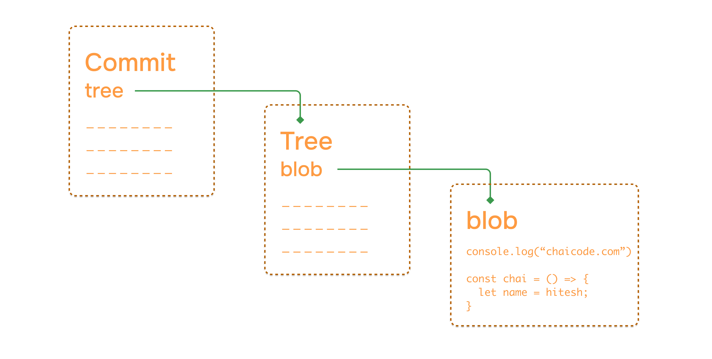

### Helpful commands
Here are some helpful commands that you can use to explore the git internals:

```bash
git show -s --pretty=raw <commit-hash>
```

Grab tree id from the above command and use it in the following command to get the tree object:

```bash
git ls-tree <tree-id>
```

Grab tree id from the above command and use it in the following command to get the blob object:

```bash
git show <blob-id>
```

Grab tree id from the above command and use it in the following command to get the commit object:

```bash
git cat-file -p <commit-id>
```

__Example:__

```bash
test on  master [+?]
❯ git log --oneline
666bca4 (HEAD -> master) Initial

test on  master [+?]
❯ git show -s --pretty=raw 666bca4
commit 666bca49a9a2f401a26211eda8bdf346860bc520
tree 46c422d84a8884cfa628a403f12503e3e6199e11
author Vishal <vishalv.c22.3@gmail.com> 1779298547 +0530
committer Vishal <vishalv.c22.3@gmail.com> 1779298547 +0530

    Initial

test on  master [+?]
❯ git ls-tree 46c422d84a8884cfa628a403f12503e3e6199e11
100644 blob 1a76f0161e90be6b98de0d4f3542bcb5a8b0c1cc    file.txt

test on  master [+?]
❯ git show 1a76f0161e90be6b98de0d4f3542bcb5a8b0c1cc
Appended line

test on  master [+?]
❯ git cat-file -p 666bca49a9a2f401a26211eda8bdf346860bc520
tree 46c422d84a8884cfa628a403f12503e3e6199e11
author Vishal <vishalv.c22.3@gmail.com> 1779298547 +0530
committer Vishal <vishalv.c22.3@gmail.com> 1779298547 +0530

Initial

```

___Note: Each thing in git store in form of object.___

---

# Branches in Git

## 🌿 1. What is a Branch in Git?

Branches are a way to work on different versions of a project at the same time. They allow you to create a separate line of development that can be worked on independently of the main branch. This can be useful when you want to make changes to a project without affecting the main branch or when you want to work on a new feature or bug fix.


Some developers can work on Header, some can work on Footer, some can work on Content, and some can work on Layout. This is a good example of how branches can be used in git.

__The Interview Answer:__
"Architecturally, a branch in Git is nothing more than a **lightweight, movable pointer** to a specific commit object. Unlike older version control systems (like SVN) that physically copy all project files into a new directory, creating a branch in Git takes milliseconds and consumes almost zero space. It simply creates a 41-byte text file inside ``.git/refs/heads/`` containing a single 40-character commit SHA-1 hash."

As you make new commits, the branch pointer automatically moves forward to point to your absolute latest snapshot.

### HEAD in git
The HEAD is a pointer to the current branch that you are working on. It points to the latest commit in the current branch. When you create a new branch, it is automatically set as the HEAD of that branch.

``the default branch used to be master, but it is now called main. There is nothing special about main, it is just a convention.``

## ⚠️ 2. Why is it Recommended to Commit Before Switching Branches?
Interviewers love to ask about safety scenarios: *"What happens if I have uncommitted code and I try to switch branches?"*

### The Technical Risk: Overwriting and Mismatches
When you switch branches, Git needs to rewrite the files in your physical **Working Directory** to match the snapshot of the target branch.

* __If your local changes do not conflict__ with the target branch, Git will let you switch and carry those uncommitted changes over with you.

* __If your local changes do conflict__ (e.g., you modified a line in ``index.js`` that has a different value in the branch you are moving to), Git will safely **block the switch** and throw an error:
``error: Your local changes to the following files would be overwritten by checkout...``

### The Production Best Practice:
To avoid messy workspaces or accidental file states, you should always empty your Working Directory before switching branches using one of two methods:

1. __Commit the work:__ Run ``git add`` and ``git commit`` to safely lock your progress into your current branch history ledger.

2. __Stash the work (If incomplete):__ Use ``git stash``. This saves your dirty working directory state into a temporary clipboard and resets your working tree to clean, allowing you to switch branches safely. You can restore it later with ``git stash pop``.


## 🕹️ 3. The Commands and Their Options
### A. The git branch Command
Used primarily to create, list, rename, and delete branches. It does not move your position into that branch.

* ``git branch`` : Lists all local branches in your repository. The active branch is highlighted with an asterisk (``*``).

* ``git branch <branch-name>`` : Creates a new branch pointer at your current commit position.

* ``git branch -d <branch-name>`` : Safe Delete. Deletes the branch only if its changes have already been safely merged into your current active branch.

* ``git branch -D <branch-name>`` : Force Delete. Wipes out the branch and its history regardless of its merge status. (Use with caution).

* ``git branch -m <new-name>`` : Renames your current active branch.

* ``git branch -v`` : ``-v`` (verbose) lists all local branches with their __last commit hash and message__, providing context on the most recent activity for each branch.

* ``git branch --merged`` : ``--merged`` filters the list to show only branches whose tips are __reachable from the current HEAD__ (i.e., fully merged into the current branch).  These branches are generally safe to delete using ``git branch -d``.

* ``git branch --no-merged`` : ``--no-merged`` lists branches whose tips are __not reachable from the current HEAD__, indicating they contain work that has not yet been integrated.  Deleting these with ``git branch -d`` will fail unless the ``-D`` (force) flag is used.

By default, if no commit argument is provided, these options compare against the __current branch__ (HEAD).  You can specify a different branch or commit (e.g., ``git branch --no-merged master``) to check merge status against a specific target without switching branches.

___Note: if we use branch command before first commit(not a single commit happen yet, like created yet newly-newly) in project, then branch command give nothing if you check for names of all branch and error type message for branch creation.___

___In a newly initialized Git repository with no commits, the ``git branch`` command returns **nothing** because **branches do not technically exist** until the first commit is created.  Although the terminal may display a prompt like (``master``) or (``main``), this represents a **non-existent branch state** required for the initial commit to occur.___

___Consequently, attempting to rename or create branches via standard commands (like ``git branch -m``) before the first commit results in errors such as ``refname refs/heads/master not found`` or ``fatal: Branch rename failed``. The branch name is only established simultaneously with the **first commit**, which transforms the repository from an empty state into one with a valid, named branch (e.g., ``master`` or ``main``).___

Example:

### B. The Legacy Navigator: ``git checkout``
Historically, ``git checkout`` was a "Swiss Army knife" command used for both branch switching and undoing file changes.

* ``git checkout <branch-name>`` : Switches your workspace focus to the target branch (moves the HEAD pointer).

* ``git checkout -b <new-branch-name>`` : A powerful shortcut that creates a new branch and immediately __switches__ you into it in a single step.

* ``git checkout <commit-sha>`` : Moves your workspace to a specific past commit, placing you in a __"Detached HEAD"__ state (useful for inspecting history).

* ``git checkout -- <file-name>`` : Discards local uncommitted modifications in your working directory, restoring the file back to its last committed state.

__Git checkout__ is known as the "Swiss Army knife" command because it performs multiple, unrelated functions within a single command, whereas newer commands like ``git switch`` and ``git restore`` are specialized for single tasks. 

* __Branch Management:__ It creates new branches (``git checkout -b``) and switches to existing ones. 
* __File Restoration:__ It reverts files to their last committed state or specific revisions, effectively undoing local changes. 
* __History Navigation:__ It allows users to view previous commits by entering a "detached HEAD" state. 

This versatility makes it powerful but also prone to confusion, as a single command can inadvertently discard work if used incorrectly for file restoration instead of branch switching. 

### C. The Modern Splitter: ``git switch``
Introduced in Git v2.23 (2019), ``git switch`` was created to separate branch navigation away from file-restoration mechanics.

* ``git switch <branch-name>`` : Safely moves your workspace focus to an existing branch.

* ``git switch -c <new-branch-name>`` : The ``-c`` stands for create. It creates a new branch and switches to it (equivalent to ``checkout -b``).


## ⚔️ 4. The Showdown: Difference Between ``branch``, ``checkout``, and ``switch``

This is a quintessential modern Git interview question. Interviewers want to see if you are updated with modern Git updates.

|Feature / Command|git branch|git checkout|git switch|
|:--:|:--:|:--:|:--:|
|__Primary Responsibility__|__Management__: Creating, listing, and destroying branch pointers.|__Multi-purpose__: Navigating branches, traveling to past commits, and discarding file changes.|__Navigation__: Purely dedicated to changing branches safely.|
|__Can it change your active branch?__|No (It only creates or alters pointers from afar).|__Yes__. Moves ``HEAD`` to another branch or commit.|__Yes__. Moves ``HEAD`` strictly to another branch.|
|__Can it modify or restore source files?__|No.|__Yes. Running__ ``git checkout <file>`` overwrites your working directory.|No. It completely lacks the ability to touch individual files.|
|__Why use it?__|To maintain your branch topography.|Kept for backward compatibility and traveling to historical commits.|__Recommended Best Practice.__ Cleaner syntax that eliminates accidental file deletion risks.|

---

# 🔥 Common Interview Follow-Up Question
## __Q: "Why did the Git core team introduce ``git switch`` when ``git checkout`` was already working perfectly fine for years?"__

__Your Answer:__ "The ``git checkout`` command was heavily overloaded. It tried to do two fundamentally different things: change branches (a safe structural move) and discard local file changes (a destructive filesystem move).

Because the syntax looked similar, a developer could make a small typo and accidentally overwrite their days of uncommitted work when they simply intended to switch branches. To resolve this user-experience flaw and prevent data loss, the Git core team split the functionality in version 2.23 into two dedicated, single-responsibility commands: ``git switch`` (strictly for navigating branches) and ``git restore`` (strictly for undoing file modifications)."

---

# Merge in Git

In Git, merging is the process of taking the independent lines of development (the commits) created on different branches and integrating them into a single branch.

When you merge, Git looks for three specific data points: the two branch tips (the latest commits) and their Common Ancestor (the point where they diverged).

* Merging is about bringing changes from one branch to another.
* In Git we have two types of merges :
  * Fast-Forward Merges (If branches have not diverged)
  * 3-Way Merges (if branches have diverged)

* after resolving the conflict we need to commit to merge, because we make changes in files while resolving the conflict.

## 🏗️ 1. The Two Main Types of Merges
In an interview, you must distinguish between these two behaviors, as Git chooses them automatically based on the repository's history.

### A. Fast-Forward Merge
This occurs when the target branch has __no new commits__ since the source branch was created. Git doesn't need to do any complex "merging" logic; it simply slides the branch pointer forward to the latest commit of the source branch.

* __Result:__ A perfectly linear history.

* __Command:__ ``git merge <feature-branch>``

* __Merge Commit:__ None is created by default.

*(__Apni basha me:__ fast forward merge means, there only work happen on single branch and no work done in second branch so git compare commit points where he see only one branch has changes so he accept it. )*

This one is easy as branch that you are trying to merge is usually ahead and there are no conflicts.

When you are done working on a branch, you can merge it back into the main branch. This is done using the following command:

```bash
git checkout main
git merge bug-fix
```

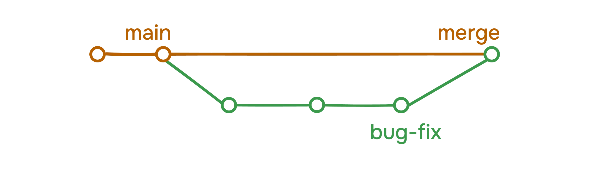

Some points to note:

* ``git checkout main`` - This command switches to the ``main`` branch.
* ``git merge bug-fix`` - This command merges the ``bug-fix`` branch into the ``main`` branch.

This is a fast-forward merge. It means that the commits in the ``bug-fix`` branch are directly merged into the ``main`` branch. This can be useful when you want to merge a branch that has already been pushed to the remote repository.

#### Example:
```bash
test on  main
❯ git branch dev

test on  main
❯ git branch
  dev
* main

test on  main
❯ git branch -v
  dev  6bd3722 Info: Initial Commit.
* main 6bd3722 Info: Initial Commit.

test on  main
❯ Get-content -path home.html
<h1>Home Page</h1>

test on  main
❯ git switch dev
Switched to branch 'dev'

test on  dev
❯ Add-Content -Path "E:\test\home.html" -Value "<p>para tag</p>"

test on  dev [!]
❯ git add .

test on  dev [+]
❯ git commit -m "Dev: add para tag."
[dev eaf5a4f] Dev: add para tag.
 1 file changed, 1 insertion(+)

test on  dev
❯ git log --oneline
eaf5a4f (HEAD -> dev) Dev: add para tag.
6bd3722 (main) Info: Initial Commit.

test on  dev
❯ git switch main
Switched to branch 'main'

test on  main
❯ git status
On branch main
nothing to commit, working tree clean

test on  main
❯ git merge dev
Updating 6bd3722..eaf5a4f
Fast-forward
 home.html | 1 +
 1 file changed, 1 insertion(+)

test on  main
❯ git status
On branch main
nothing to commit, working tree clean

test on  main
❯ Get-content -path home.html
<h1>Home Page</h1>
<p>para tag</p>

test on  main
❯ git branch -v
  dev  eaf5a4f Dev: add para tag.
* main eaf5a4f Dev: add para tag.

test on  main
❯ git branch --merged
  dev
* main

test on  main
❯ git branch -d dev
Deleted branch dev (was eaf5a4f).

test on  main
❯ git branch --merged
* main

test on  main
❯ git branch -v
* main eaf5a4f Dev: add para tag.

```

#### Example: fast-forward merge if there is only work happen in one branch and no modifications on second branch.
```bash
test on  main took 13s
❯ git branch
* main

test on  main
❯ git switch -c fix
Switched to a new branch 'fix'

test on  fix
❯ get-content -path home.html
<h1>Home Page</h1>
<p>para tag</p>

test on  fix
❯ edit home.html

test on  fix [!] took 55s
❯ get-content -path home.html
<h1>Home Page</h1>
<strong>New Line, Not change in pre exist lines</strong>
<p>para tag</p>

test on  fix [!]
❯ git add .

test on  fix [+]
❯ git commit -m "Info: Test Fast-Forward Merge."
[fix 51d5b2b] Info: Test Fast-Forward Merge.
 1 file changed, 1 insertion(+)

test on  fix
❯ git switch main
Switched to branch 'main'

test on  main
❯ git status
On branch main
nothing to commit, working tree clean

test on  main
❯ git branch -v
  fix  51d5b2b Info: Test Fast-Forward Merge.
* main eaf5a4f Dev: add para tag.

test on  main
❯ git merge fix
Updating eaf5a4f..51d5b2b
Fast-forward
 home.html | 1 +
 1 file changed, 1 insertion(+)

test on  main
❯ git status
On branch main
nothing to commit, working tree clean

test on  main
❯ git log --oneline
51d5b2b (HEAD -> main, fix) Info: Test Fast-Forward Merge.
eaf5a4f Dev: add para tag.
6bd3722 Info: Initial Commit.

test on  main
❯ git branch -v
  fix  51d5b2b Info: Test Fast-Forward Merge.
* main 51d5b2b Info: Test Fast-Forward Merge.

```

### B. 3-Way Merge (Recursive)
This occurs when the target branch and the feature branch have both diverged (both have new, unique commits). Git cannot just "slide" the pointer. It must create a new __Merge Commit__ that has two parent commits.

* __The "3-Way" logic:__ Git looks at:

  1 Commit A (Target branch tip)

  2 Commit B (Source branch tip)

  3 __Common Ancestor__ (The divergence point)

* __Result:__ A non-linear history with a dedicated "Merge commit" message.

* __Merge Commit:__ A new "Merge commit" is automatically generated to tie the two paths together.

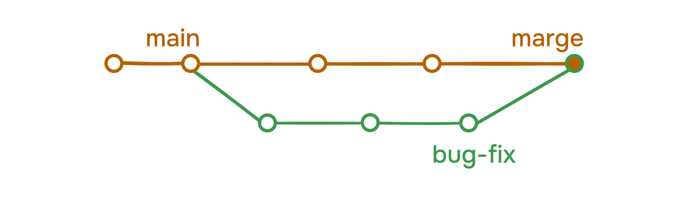

In this type of merge, the main branch has additional commits that are not present in the ``bug-fix`` branch. This is not a fast-forward merge. Here git looks at 3 different commits [common ancestor of branches + tips of each branch] and combines the changes into one merge commit.

When you are done working on a branch, you can merge it back into the main branch. This is done using the following command:

```bash
git checkout main
git merge bug-fix
```

*If the command are same, what is the difference between fast-forward and not fast-forward merge?*

The difference is resolving the conflicts. In a fast-forward merge, there are no conflicts. But in a not fast-forward merge, there are conflicts, and there are no shortcuts to resolve them. You have to manually resolve the conflicts. Decide, what to keep and what to discard. VSCode has a built-in merge tool that can help you resolve the conflicts.


## 🛠️ 2. The Merge Workflow
__1.Switch to Target:Required.__
Navigate to the branch you want to merge into (e.g., main).

```bash
git switch main
```

__2.Update Local:Optional but Recommended.__
Pull the latest changes from the remote to avoid working on stale code.

```bash
git pull origin main
```

__3.Execute Merge:Action.__
Bring the feature branch changes into your current branch.

```bash
git merge feature-branch
```

## ⚡ 3. Handling Merge Conflicts
A __Merge Conflict__ happens when Git cannot automatically decide which change to keep—specifically when the same line in the same file was modified in both branches.

### The Workflow to Solve Conflicts:
1. __Identify the files:__ Git will stop the merge and say ``Automatic merge failed; fix conflicts and then commit the result.`` Run ``git status`` to see the "Unmerged paths."

2. __Locate the Conflict Markers:__ Open the file. Git injects visual markers to show you the difference:


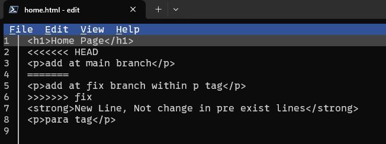

__In Short:__ *when auto merge fail then use git status command to identify in which files conflict occurs then open those file in any text editor then find conflict marker where you have three option first take current branch modification and discard other branch work, second is vice-versa means keep second branch content and discard first branch content, and third option is keep both. after that remove all styling conflict markers and then save the file and know add the file in staging area and make a merge commit with merge message like "Info: merge dev branch".*

*__Note:__ If you get overwhelmed, you can always cancel the whole attempt with `git merge --abort`*

## 🎯 4. Comparison: Fast-Forward vs. 3-Way
|Feature|Fast-Forward|3-Way Merge|
|:--:|:--:|:--:|
|History Shape|Linear (straight line)|Branching (shows the "loop" where work diverged)|
|Merge Commit|No new commit created|Creates a new "Merge commit"|
|Conflict Risk|Low (usually no conflicts)|High (happens if both branches changed the same lines)|
|Trigger|Source branch is directly ahead of Target|Both branches have moved forward independently|

## 📋 5. git merge Options for Interviews
|Option|Effect|Use Case|
|:--:|:--:|:--:|
|``--no-ff``|Forces a 3-way merge even if a fast-forward is possible.|Keeps feature history visible as a "loop" in the graph.|
|``--ff-only``|Refuses to merge unless a fast-forward is possible.|Ensures you don't accidentally create merge commits.|
|``--squash``|Combines all feature commits into one single commit on the target branch.|Keeps the main history very clean and concise.|
|``--abort``|Stops the merge process and resets your branch to its pre-merge state.|Use when a conflict is too messy to solve right now.|

---

# 🔥 Common Interview Follow-Up
## Q: "When would you choose a Squash Merge over a standard merge?"
__Your Answer:__ "A squash merge is best when a feature branch has dozens of tiny 'work-in-progress' commits (like 'fixed typo' or 'temp save') that don't add value to the project's permanent history. By squashing, we maintain a clean ``main`` branch where every commit represents a fully functional feature, though we lose the granular step-by-step history of how that feature was built."

## Q: "Is a Fast-Forward merge always better because it keeps history clean?"
__Your Answer:__ "Not necessarily. While Fast-Forwarding keeps the history linear and easy to read, it __destroys the context__ of the feature branch. Once you merge, you can't easily see that those four commits were part of one specific feature.

Many teams use the ``--no-ff`` (no fast-forward) flag:

```Bash
git merge --no-ff feature-branch
```

This forces Git to create a Merge Commit even if it *could* have fast-forwarded. This preserves the visual 'bracket' in the history, making it clear where a feature started and ended, which is invaluable for debugging or reverting features later."

---

# Git diff

The ``git diff`` is an informative command (means do nothing just give information) that shows the differences between two commits. It is used to compare the changes made in one commit with the changes made in another commit. Git consider the changed versions of same file as two different files. Then it gives names to these two files and shows the differences between them.

## 🔍 1. What is the git diff Command?
__The Interview Answer:__
"``git diff`` is a diagnostic tool used to compare different states of data within the Git architecture. It computes the differences (deltas) between any two data sources—such as your Working Directory, the Staging Area, specific commits, or different branches. It reads these states and outputs them in a unified diff format."

## 📖 2. How to Read a git diff Output
Let’s decode the exact output from your log line-by-line. This is a common requirement in practical technical interviews.

* ``a/`` – the original file (before changes)
* ``b/`` – the updated file (after changes)
* ``---`` – marks the beginning of the original file
* ``+++`` – marks the beginning of the updated file
* ``@@`` – shows the line numbers and position of changes

Here the file A and file B are the same file but different versions.

Git will show you the changes made in the file A and file B. It will also show you the line number where the change occurred along with little preview of the change.

__Example:__
```bash
diff --git a/home.html b/home.html
index d4d2f23..113c6d0 100644
--- a/home.html
+++ b/home.html
@@ -1,6 +1,8 @@
+<html>
 <body>
 <h1>Home Page</h1>
...
```

* __Line 1 (``diff --git a/home.html b/home.html``):__ Shows the internal keys being compared. Git treats the source file as ``a/`` and the target file as ``b/``.

* __Line 2 (``index d4d2f23..113c6d0 100644``):__ Lists the internal Git object hashes (blobs) of the two file states being compared, followed by the file mode (``100644`` means a normal, non-executable text file).

* __Lines 3 & 4 (``--- a/home.html`` and ``+++ b/home.html``):__ Assigns symbols. --- represents the original state, and ``+++`` represents the new modifications.

* Line 5 (``@@ -1,6 +1,8 @@``): This is the hunk header.

  * ``-1,6`` means: In the original file, this section starts at line 1 and spans 6 lines.

  * ``+1,8`` means: In the modified file, this section starts at line 1 and now spans 8 lines.

* The Text Lines:

  * Lines starting with a space are unchanged context lines.

  * Lines starting with a green plus `+` were added in the target state.

  * Lines starting with a red minus `-` were removed from the source state.

---

## 🗺️ 3. The Great Matrix: What are you comparing?
Your terminal test highlights the fundamental rule of Git's default diff behavior. Let's look at exactly how to target different comparisons.

### A. The Default: Working Directory vs. Staging Area
* __The Command:__ ``git diff``

This command shows the unstaged changes in your working directory compared to the staging area. This command alone will not show you the changes made in the file A and file B, you need to provide options to show the changes.

* __What it does:__ Compares what is currently on your hard drive (Working Directory) with what you have already frozen via ``git add`` (Staging Area).

* __Why your log behaved this way:__ 

  1. You added the ``<body>`` changes to the staging area.
  2. You then added ``<html>`` tags to the file on your hard drive but did not run git add.
  3. Running ``git diff`` showed only the ``<html>`` tags because those were the only differences between your screen and the staging buffer.

__⚠️ The Interview Core Trap:__ If a file has been modified but you run ``git add``, running a plain ``git diff`` immediately after will output __nothing__. Why? Because your Working Directory and Staging Area are now perfectly identical.

__Example:__
```bash
test on  master
❯ edit home.html

test on  master
❯Get-Content -path home.html
<body>
<h1>Home Page</h1>
<p>add at fix branch within p tag</p>
<strong>New Line, Not change in pre exist lines</strong>
<p>para tag</p>
</body>

test on  master [!] took 19s
❯ git status
On branch master
Changes not staged for commit:
  (use "git add <file>..." to update what will be committed)
  (use "git restore <file>..." to discard changes in working directory)
        modified:   home.html

no changes added to commit (use "git add" and/or "git commit -a")

test on  master [!]
❯ git add home.html

test on  master [+]
❯ git status
On branch master
Changes to be committed:
  (use "git restore --staged <file>..." to unstage)
        modified:   home.html

test on  master
❯ edit home.html

test on  master
❯Get-Content -path home.html
<html>
<body>
<h1>Home Page</h1>
<p>add at fix branch within p tag</p>
<strong>New Line, Not change in pre exist lines</strong>
<p>para tag</p>
</body>
</html>

test on  master [!+]
❯ git status
On branch master
Changes to be committed:
  (use "git restore --staged <file>..." to unstage)
        modified:   home.html

Changes not staged for commit:
  (use "git add <file>..." to update what will be committed)
  (use "git restore <file>..." to discard changes in working directory)
        modified:   home.html

❯ git diff
diff --git a/home.html b/home.html # a/home.html represent to staging file, and b/home.html represent to modified file.
index d4d2f23..113c6d0 100644
--- a/home.html
+++ b/home.html
@@ -1,6 +1,8 @@
+<html>
 <body>
 <h1>Home Page</h1>
 <p>add at fix branch within p tag</p>
 <strong>New Line, Not change in pre exist lines</strong>
 <p>para tag</p>
 </body>
+</html>
```

### B. Staged Files vs. Previous Commit
* __The Command:__ ``git diff --staged`` (or ``git diff --cached``)

This command shows the changes between your last commit and the staging area (i.e., changes that are staged and ready to be committed).

__What it does:__ Compares what is sitting inside your __Staging Area__ with your last snapshot (__HEAD commit__). This answers the interview question: *"How do I review exactly what changes are about to be written into my next commit?"*

__Example:__
```bash
test on  master [!+]
❯ git diff --staged
diff --git a/home.html b/home.html # b/home.html is staged file. 
index 74d4bd4..d4d2f23 100644
--- a/home.html
+++ b/home.html
@@ -1,4 +1,6 @@
+<body> # this line start with + means this line not exist in a/home.html means in previous commit, added on current staged file b/home.html
 <h1>Home Page</h1>
 <p>add at fix branch within p tag</p>
 <strong>New Line, Not change in pre exist lines</strong>
 <p>para tag</p>
+</body>
```

### C. Working Directory vs. Previous Commit
* __The Command:__ ``git diff HEAD``

* __What it does:__ Ignores the Staging Area entirely. It compares everything currently on your hard drive directly against your last commit snapshot.

__Example:__
```bash
test on  master [!+]
❯ git diff HEAD
diff --git a/home.html b/home.html
index 74d4bd4..113c6d0 100644
--- a/home.html
+++ b/home.html
@@ -1,4 +1,8 @@
+<html>
+<body>
 <h1>Home Page</h1>
 <p>add at fix branch within p tag</p>
 <strong>New Line, Not change in pre exist lines</strong>
 <p>para tag</p>
+</body>
+</html>
```

## 🔀 4. Advanced Comparisons (Commits, Branches, and Specific Files)
### Between Two Commits
* __Using Space:__ ``git diff <commit1-sha> <commit2-sha>``

* __Using Dots:__ ``git diff <commit1-sha>..<commit2-sha>``

* __Note:__ In Git, both syntaxes yield the exact same result for simple commit-to-commit comparisons. It shows the changes needed to turn ``commit1`` into ``commit2``.

__Example:__
```bash
test on  master [!+]
❯ git log --oneline
8b25859 (HEAD -> master) Info: Changes in fix.
052ca11 (improve) Info: Changes in fix.
60d53f3 Info: Changes in main.
08b7ba4 Info: Merge fix branch.
ad07053 Info: Edit on fix branch.
9dec0a0 Info: Edit on main branch.
51d5b2b Info: Test Fast-Forward Merge.
eaf5a4f Dev: add para tag.
6bd3722 Info: Initial Commit.

test on  master [!+]
❯ git diff 8b25859 6bd3722
diff --git a/home.html b/home.html
index 74d4bd4..d62a4c4 100644
--- a/home.html
+++ b/home.html
@@ -1,4 +1 @@
 <h1>Home Page</h1>
-<p>add at fix branch within p tag</p>
-<strong>New Line, Not change in pre exist lines</strong>
-<p>para tag</p>

test on  master [!+]
❯ git diff 6bd3722 8b25859
diff --git a/home.html b/home.html
index d62a4c4..74d4bd4 100644
--- a/home.html
+++ b/home.html
@@ -1 +1,4 @@
 <h1>Home Page</h1>
+<p>add at fix branch within p tag</p>
+<strong>New Line, Not change in pre exist lines</strong>
+<p>para tag</p>

test on  master [!+]
❯ git diff 6bd372..8b25859
diff --git a/home.html b/home.html
index d62a4c4..74d4bd4 100644
--- a/home.html
+++ b/home.html
@@ -1 +1,4 @@
 <h1>Home Page</h1>
+<p>add at fix branch within p tag</p>
+<strong>New Line, Not change in pre exist lines</strong>
+<p>para tag</p>
```

### Between Two Branches
* __The Command:__ ``git diff main..feature-branch``

* Shows all code differences between the tips of the two specified branches.

### Target Specific Files (The ``--`` Selector)
If you only want to see changes for one specific file across branches or commits, append a space, two dashes, and the filename:

* __Specific file between commits:__ ``git diff <sha1> <sha2> -- path/to/file.js``

* __Specific file between branches:__ ``git diff main..feature -- home.html``

---

# 🔥 Common Interview Follow-Up Questions
## Q1: "What is the difference between ``git diff branchA..branchB`` and ``git diff branchA...branchB`` (Two dots vs Three dots)?"
__Your Answer:__ "This is a major architectural difference:

* ``git diff branchA..branchB`` compares the absolute tips of both branches directly.

* ``git diff branchA...branchB`` finds the common ancestor where ``branchB`` originally split off from ``branchA``, and compares ``branchB`` against that ancestor. It filters out any changes that happened on ``branchA`` after the split, showing only what was written inside the feature branch."

## Q2: "How can you get a quick summary of changed files via git diff without printing the thousands of lines of code changes?"
__Your Answer:__ "You can use the stat flag:

```Bash
git diff --stat
```

This generates a high-level summary listing the names of altered files, how many lines were added or removed in each, and a small visual bar chart representing the volume of changes."

__Example:__
```bash
test on  master [!+]
❯ git diff
diff --git a/home.html b/home.html
index d4d2f23..113c6d0 100644
--- a/home.html
+++ b/home.html
@@ -1,6 +1,8 @@
+<html>
 <body>
 <h1>Home Page</h1>
 <p>add at fix branch within p tag</p>
 <strong>New Line, Not change in pre exist lines</strong>
 <p>para tag</p>
 </body>
+</html>

test on  master [!+]
❯ git diff --stat
 home.html | 2 ++
 1 file changed, 2 insertions(+)
```

---

# Git stash

Stash is a way to save your changes in a temporary location. It’s useful when switching branches without losing work. You can then come back to the file later and apply the changes.

*Conflicting changes will not allow you to switch branches without committing the changes. Another alternative is to use the `git stash` command to save your changes in a temporary location.*

```bash
git stash
```

This command saves your changes in a temporary location. It is like a stack of changes that you can access later.

## 💾 1. What is the git stash Command?
__The Interview Answer:__
"`git stash` is a clipboard-like utility that allows developers to safely save their uncommitted changes (both modified tracked files and optionally untracked files) into a temporary storage stack without creating a formal commit history entry. It resets your __Working Directory__ and __Staging Area__ back to a clean state (`HEAD`), allowing you to switch contexts or branches instantly. You can later restore those exact changes back to any branch."

## 🪜 2. The Internal Architecture of the Stash Stack
Mechanically, the stash is structured as a __Stack__ data structure (Last-In, First-Out / LIFO). Every time you run `git stash`, your changes are pushed onto the top of this stack.

When you inspect the stash index, it looks like this:

* `stash@{0}`: The absolute latest changes you just saved (Top of the stack).

* `stash@{1}`: The changes you saved before that.

* `stash@{2}`: Older saved changes, and so on.

## 🕹️ 3. Critical Stash Commands and Options

### Naming the stash
You can also name the stash by using the following command:

```bash
git stash save "work in progress on X feature"
```

### View the stash list
You can view the list of stashes by using the following command:

```bash
git stash list
```

### Apply the Most Recent Stash
You can apply the stash by using the following command:

```bash
git stash apply
```

### Apply Specific Stash
You can apply the specific stash by using the following command:

```bash
git stash apply stash@{0}
```

Here `stash@{0}` is the name of the stash. You can use the `git stash list` command to get the name of the stash.

### Applying and Drop a Stash
You can apply and drop the stash by using the following command:

```bash
git stash pop
```

This command applies the stash and drops it from the stash list.

### Drop the stash
You can drop the stash by using the following command:

```bash
git stash drop
```

### Applying stash to a specific branch
You can apply the stash to a specific branch by using the following command:

```bash
git stash apply stash@{0} <branch-name>
```

### Clearing the stash
You can clear the stash by using the following command:

```bash
git stash clear
```

*In-Deep View*

To pass an advanced interview, you must know more than just git stash. You need to know how to manipulate the stack.

### A. Saving Work
* `git stash` (or `git stash push`): Saves your current tracked modifications and cleans your working directory.

* __The Untracked Flag:__ `git stash -u` (or `--include-untracked`)

  * *Crucial Interview Nuance:* By default, running a plain `git stash` __ignores brand-new, untracked files__. If you created a new component file and try to stash, it will stay stuck on your hard drive. Passing `-u` forces Git to sweep untracked files into the stash as well.

* `git stash -m "Working on payment gateway"`: Attaches a descriptive name to your stash entry, making it highly readable when you look at the stack later.

### B. Inspecting Work
* `git stash list`: Displays a reverse-chronological list of all your saved stashes with their corresponding `stash@{N}` identifiers.

* `git stash show -p stash@{0}`: Shows the actual line-by-line code changes (`diff`) inside a specific stash entry before you apply it.

### C. Restoring Work
There are two ways to bring code back from the stash stack:

1. `git stash pop` __(Recommended for single tasks):__ Applies the changes from the top entry (`stash@{0}`) back into your current working directory and __permanently removes__ that entry from the stash stack.

2. `git stash apply` __(Safer choice):__ Applies the changes from `stash@{0}` but __leaves a backup copy__ sitting on the stash stack.

## ⚔️ The Showdown: `git stash pop` vs. `git stash apply`
Interviewers frequently ask candidates to choose between these two restoration methods.

|Feature|git stash pop|git stash apply|
|:--:|:--:|:--:|
|__Stack Modification__|__Destructive.__ Deletes the entry from the stack immediately upon successful restoration.|__Non-destructive.__ Keeps the entry in the stack registry until explicitly cleared.|
|Use Case|Use when you are 100% sure you are back on the correct branch and just want to resume work immediately.|Use when you want to apply the same stashed changes to multiple branches sequentially, or want a safety net.|
|__Handling Conflicts__|If a merge conflict occurs, `pop` behaves like `apply`—it __will not__ delete the stash entry until you resolve the conflict manually.|If a conflict occurs, the stash entry remains safely untouched in the registry.|

---

# 🔥 Common Interview Follow-Up Questions
## Q1: "What happens if I stash changes on `feature-A` branch, switch to `feature-B` branch, and run `git stash pop`?"
__Your Answer:__ "Git will attempt to apply the stashed changes from `feature-A` directly into the working directory of `feature-B`.

* If the code changes do not overlap or conflict with `feature-B`'s files, the pop succeeds, and your changes successfully migrate to the new branch.

* If they touch the same lines of code, Git will halt the operation, trigger a standard merge conflict, and preserve the stash entry in the stack so you don't lose data."

## Q2: "How do you completely clear out your stash stack if it gets cluttered with old entries?"
__Your Answer:__ "To drop a specific single entry, I would use its identifier, like `git stash drop stash@{2}`. If I want to do a complete repository housecleaning and wipe out the entire stack history at once, I would use:

```Bash
git stash clear
```
*Warning:* `git stash clear` is a completely destructive action and cannot be easily undone via standard commands."

---

# what happen when two branches head point at same place like they merge then what happen, in this scenario if i make any changes in any branch they point at same point then reflect in all branches because there head point same place

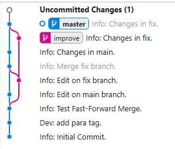
<center>Image 44</center>

This is one of the most critical conceptual breakthroughs when learning Git! Looking at your extension graph, you can clearly see the blue master label and the pink improve label pointing to the exact same commit node ("Info: Changes in fix.").

Let’s tackle your exact question: If two branches point to the exact same place, and you make a change, does it reflect in both branches?

The short answer is: No, it will not change both branches. It will only update the branch you are currently standing on.

Here is exactly how Git handles this under the hood, and how you should explain it in an interview to prove you understand reference pointers.

## 🧭 1. The Missing Link: The HEAD Pointer
To understand why only one branch moves, you have to look at the `HEAD` pointer.

While both `master` and `improve` point to the same commit hash, `HEAD` can only __point to one branch at a time__. `HEAD` is Git's way of saying, *"You are currently working here."*

### What it looks like right now in your terminal:
If you are currently switched to the master branch, your internal architecture looks like this:

```text
  [ HEAD ]
      │
      ▼
  [ master ] ──┐
               ├─► Commit: "Info: Changes in fix."
  [ improve ] ─┘
```

## 🏃 2. What Happens When You Make a New Commit?
Let's trace the exact mechanics of what happens if you stay on `master` and `run git commit -m "New Work"`.

1. Git looks at `HEAD` to see which branch is active (`master`).

2. Git creates the new commit object.

3. Git automatically updates only the active branch pointer (`master`) to point to this brand-new commit.

4. The inactive branch pointer (`improve`) remains completely frozen where it was.

__The resulting layout:__

```text
                          [ HEAD ]
                              │
                              ▼
  [ improve ] ──► Commit: "Info: Changes in fix."
                              ▲
                              │
  [ master ]  ──► Commit: "New Work"
```

In your visual graph, this would cause the blue line to step forward one node into a new commit, while the pink improve label stays stuck behind on the older node. They have instantly diverged again!

## 🌀 3. Why This Confuses People: Uncommitted Files vs. Committed History
The source of confusion usually comes from __uncommitted changes__ sitting on your hard drive (your Working Directory).

If you have modified a file but have __not__ committed it yet:

* If you run `git switch improve` or `git switch master`, Git will easily let you bounce back and forth because both branches match the exact same baseline commit.

* Because the file edits are just sitting loosely on your hard drive, you will see those modifications on both branches.

* However, the moment you run `git commit`, that change is permanently locked to __whichever branch `HEAD` was pointing to__ at that exact second.

```bash
test on  master [!+]
❯ git status
On branch master
Changes to be committed:
  (use "git restore --staged <file>..." to unstage)
        modified:   home.html

Changes not staged for commit:
  (use "git add <file>..." to update what will be committed)
  (use "git restore <file>..." to discard changes in working directory)
        modified:   home.html


test on  master [!+]
❯ git diff
diff --git a/home.html b/home.html
index d4d2f23..113c6d0 100644
--- a/home.html
+++ b/home.html
@@ -1,6 +1,8 @@
+<html>
 <body>
 <h1>Home Page</h1>
 <p>add at fix branch within p tag</p>
 <strong>New Line, Not change in pre exist lines</strong>
 <p>para tag</p>
 </body>
+</html>

test on  master [!+]
❯ git checkout improve
M       home.html
Switched to branch 'improve'

test on  improve [!+]
❯ get-content -path home.html
<html>
<body>
<h1>Home Page</h1>
<p>add at fix branch within p tag</p>
<strong>New Line, Not change in pre exist lines</strong>
<p>para tag</p>
</body>
</html>

test on  improve [!+]
❯ edit home.html

test on  improve [!+] took 9s
❯ git checkout master
M       home.html
Switched to branch 'master'

test on  master [!+]
❯ get-content -path home.html

<body>
<h1>Home Page</h1>
<p>add at fix branch within p tag</p>
<strong>New Line, Not change in pre exist lines</strong>
<p>para tag</p>
</body>


test on  master [!+]
❯ git diff master...improve

```

## 🔍 Understanding `git diff master...improve`
The __triple-dot__ syntax (`...`) is highly specific in Git. It does not compare the two branch tips directly. Instead, it finds the __common ancestor__ (the point where `improve` originally diverged from `master`) and compares the tip of `improve` against that ancestor.

Looking at your graph:

* Both `master` and `improve` currently point to the same commit: __"Info: Changes in fix.".__

* Because they point to the same commit, the "common ancestor" and the "tip of improve" are identical.

* __Result:__ The command `git diff master...improve` will output nothing because there are no unique commits on the `improve` branch that are not already present in the shared history of `master`.

## 🛠️ Why did your file content change?
You experienced a classic Git behavior regarding uncommitted changes and branch switching.

### 1. The Migration (Moving to `improve`)
When you first ran `git checkout improve`, your `home.html` had both __staged__ and __unstaged__ changes (the `<html>` tags). Since `master` and `improve` pointed to the same commit, there was no conflict. Git allowed the switch and __carried your uncommitted changes over__ to the `improve` branch. This is why `get-content` showed the `<html>` tags while you were on `improve`.

### 2. The Edit and Return (Moving back to `master`)
You edited the file while on `improve` and then switched back to `master`. The message `M home.html` during the checkout indicated that Git was still carrying your modified (but uncommitted) file across branches.

However, your final `get-content` on `master` shows the `<html>` tags are missing. This likely happened because:

* During your `edit home.html` step on the `improve` branch, you may have reverted those lines or saved a version that did not include them.

* Alternatively, if you ran a `git restore` or a similar command hidden in your "edit" step, the working directory was updated.

## 🎯 Key Takeaways for the Interview
* __Uncommitted Changes are "Global":__ Until you run `git commit`, your changes live in the __Working Directory__ or __Staging Area__, not on a branch. They will "follow" you when you switch branches as long as they don't conflict with the destination branch's files.

* __The Triple Dot vs. Double Dot:__

  * `master..improve` compares the two tips directly.

  * `master...improve` compares the tip of `improve` to the common ancestor it shares with `master`.

* __Current State:__ Because your `master` and `improve` labels in image44 are on the same node, `git diff master improve` (direct comparison) would also return nothing because their committed histories are currently identical.

---

# 🎯 The Interviewer's Framework

## If an interviewer asks you: *"If `branchA` and `branchB` point to the same commit, are they linked?"*

__Your Answer:__

"No, branches in Git are completely independent, lightweight pointers. They are not linked to each other; they simply happen to contain the same 40-character commit SHA-1 hash at this moment. When a new commit is made, Git checks the symbolic `HEAD` reference to find the active branch, updates that specific pointer to the new commit's hash, and leaves the other branch pointer completely untouched."

---

# Git tag

Tags are a way to mark a specific point in your repository. They are useful when you want to remember a specific version of your code or when you want to refer to a specific commit. Tags are like sticky notes that you can attach to your commits.

### Creating a tag
You can create a tag using the following command:

```bash
git tag <tag-name>
```

This command creates a new tag with the specified name. The tag will be attached to the current commit.

### Create an annotated tag
You can create an annotated tag using the following command:

```bash
git tag -a <tag-name> -m "Release 1.0"
```

This command creates an annotated tag with the specified name and message. The tag will be attached to the current commit.

### List all tags
You can list all tags using the following command:

```bash
git tag
```

This command lists all the tags in your repository.

### Tagging a specific commit
You can tag a specific commit using the following command:

```bash
git tag <tag-name> <commit-hash>
```

### Push tags to remote repository
You can push tags to a remote repository using the following command:

```bash
git push origin <tag-name>
```

### Delete a tag
You can delete a tag using the following command:

```bash
git tag -d <tag-name>
```

### Delete tag on remote repository
You can delete a tag on a remote repository using the following command:

```bash
git push origin :<tag-name>
```

## 🏷️ 1. What is a Git Tag?
__The Interview Answer:__
"A Git Tag is an immutable reference pointer that marks a specific, significant point in a repository’s history—most commonly used to highlight release versions (e.g., `v1.0.0`, `v2.4.0-beta`). While branches are dynamic and move forward with every new commit, a tag is structurally frozen. Once attached to a commit, it never moves, serving as a permanent historical marker."

## 🏢 2. Industry Workflows: Internal Development vs. Public Release
Your observation about ignoring tags during daily internal development but mandating them for public releases is an industry best practice.

### Internal Development (No Tags)
* During daily sprints, developers commit code dozens of times a day to feature or develop branches.

* Tagging every single internal commit would clutter the repository data structure and add zero value. Internal tracking relies entirely on branch names and short commit SHA-1 hashes.

### Major Updates & Open Source Releases (Tags Mandated)
* __Production Releases:__ When code moves to production, a tag is cut. This tells the entire organization exactly which state of the codebase is currently running live in the real world.

* __Open Source & Semantic Versioning (v2.1.0-beta):__ In open-source projects, tags are crucial for package managers (like npm, pip, or NuGet). It allows users to safely target stable releases or test beta versions without pulling broken, in-progress code from the active `main` branch.

### Who applies them?
As you noted, individual developers rarely cut release tags during their daily coding. This responsibility typically falls to __Product Managers, Release Managers,__ or automated __CI/CD Deployment Pipelines__ (like GitHub Actions) triggered by a production approval sign-off.

## 📐 3. The Two Types of Git Tags
An interviewer will expect you to know that Git handles tags in two fundamentally different ways under the hood.

### A. Lightweight Tags (Simple Pointers)
* __What it is:__ A lightweight tag is just a named pointer to a commit. It is literally just a text file inside `.git/refs/tags/` containing a commit SHA-1 hash. It contains no extra metadata.

* __Command:__ `git tag v1.0.0-light`

* __Use Case:__ Quick, private, local bookmarking.

### B. Annotated Tags (Production/Industry Standard)
* __What it is:__ An annotated tag is stored as a __full database object__ in Git. It is checksummed, and it contains the name of the person who created it, their email, a timestamp, and a dedicated tag message (like a commit message). They can also be cryptographically signed using GPG keys for security verification.

* __Command:__ `git tag -a v1.0.0 -m "Official production release of checkout module"`

* __Use Case: All public and official industry releases.__

## 🕹️ 4. Critical Tag Commands and Options
### Listing Tags
* `git tag`: Lists all tags in the repository alphabetically.

* `git log --oneline --decorate`: Shows your commit history alongside branch pointers and tag markers cleanly.

### Tagging Past History
If a release manager forgot to tag a release yesterday and five new commits have been made since, they don't have to panic. They can target a past commit hash directly:

* `git tag -a v1.2.0 <past-commit-sha1> -m "Delayed release tag"`

### Sharing Tags with Remote (GitHub)
* *Crucial Interview Trap*: Running `git push` does not send your tags to GitHub. Tags must be explicitly pushed to the server.

* Push a single tag: `git push origin v1.0.0`

* Push all local tags at once: `git push origin --tags`

---

# 🔥 Common Interview Follow-Up Question
__Q: "If both a Branch and a Tag are just pointers to a commit, what is the mechanical difference between them under the hood?"__
__Your Answer:__ "The core difference lies in their __mutability__.

1. __A Branch pointer is dynamic.__ When you are on a branch and make a new commit, Git automatically moves that branch pointer forward to the new commit hash.

2. __A Tag pointer is static.__ It is completely immutable. If you switch to a tag and make a new commit, the tag does not move. Instead, Git will put you into a __Detached HEAD__ state because your active workspace left the tag marker behind.

*In short: Branches track ongoing journeys; tags freeze specific destinations."*

---

# Skip Staging Area

new created file they are not track(Untracked files) before not directly committed it should be first stage

```bash
git commit -a -m "message"
```

---

# How to add a file in last commit

To add a file to the last commit, stage the file using `git add` and then amend the commit using `git commit --amend`.  This process rewrites the most recent commit to include the new changes.

## Steps
1. __Stage the file:__ Add the file you want to include to the staging area.
```bash
git add <file-name>
```

2. __Amend the commit:__ Update the last commit to include the staged changes.
* To keep the existing commit message, use the `--no-edit` flag:

```bash
git commit --amend --no-edit
```

* To change the commit message, simply run:
```bash
git commit --amend
```

## Important Note
__Amending commits rewrites history.__ If you have already pushed the original commit to a remote repository, you must force-push to update it:

```bash
git push --force-with-lease
```

Avoid amending commits that have been pushed to shared branches, as this can cause conflicts for other collaborators.

__Example:__ *Suppose developer forget the untracked file not directly committed (skip staging area) and it perform commit, when he realize that he need to edit last commit.*

```bash
CheckMate on  main [!?] 
❯ git status              
On branch main
Changes not staged for commit:
  (use "git add <file>..." to update what will be committed)
  (use "git restore <file>..." to discard changes in working directory)
        modified:   01_git/notes.md

Untracked files:
  (use "git add <file>..." to include in what will be committed)
        01_git/z00_images/image44.png

no changes added to commit (use "git add" and/or "git commit -a")

CheckMate on  main [!?] 
❯ git commit -a -m "Info: File Content changes between branches"
[main b323085] Info: File Content changes between branches
 1 file changed, 188 insertions(+), 1 deletion(-)

CheckMate on  main [?] 
❯ git status                                                    
On branch main
Untracked files:
  (use "git add <file>..." to include in what will be committed)
        01_git/z00_images/image44.png

nothing added to commit but untracked files present (use "git add" to track)

CheckMate on  main [?] 
❯ git add . 

CheckMate on  main [+] 
❯ git status
On branch main
Changes to be committed:
  (use "git restore --staged <file>..." to unstage)
        new file:   01_git/z00_images/image44.png


CheckMate on  main [+] 
❯ git commit --amend                                            
[main 6fa9ddd] Info: File Content changes between branches
 Date: Fri May 29 17:37:02 2026 +0530
 2 files changed, 188 insertions(+), 1 deletion(-)
 create mode 100644 01_git/z00_images/image44.png

CheckMate on  main took 10s 
❯ git status
On branch main
nothing to commit, working tree clean

CheckMate on  main 
❯ git log --oneline
6fa9ddd (HEAD -> main) Info: File Content changes between branches
971370a Desc: git stash
199eb20 desc: Git diff
c9dda47 Desc: Git Merge
8a79dc8 Desc: Git branch, checkout and switch command.
232cebd fix: formatting fix
6ee432f docs: git behind the scene
33654a1 docs: git local workflow notes

```
---

# Show Git Graph is PowerShell

```bash
git log --graph --oneline --all --decorate   
```

__Example:__
```bash
test on  master [!+]
❯ git log --oneline
8b25859 (HEAD -> master) Info: Changes in fix.
052ca11 (improve) Info: Changes in fix.
60d53f3 Info: Changes in main.
08b7ba4 Info: Merge fix branch.
ad07053 Info: Edit on fix branch.
9dec0a0 Info: Edit on main branch.
51d5b2b Info: Test Fast-Forward Merge.
eaf5a4f Dev: add para tag.
6bd3722 Info: Initial Commit.

test on  master [!+]
❯ git log --graph --oneline --all --decorate
*   8b25859 (HEAD -> master) Info: Changes in fix.
|\
| * 052ca11 (improve) Info: Changes in fix.
* | 60d53f3 Info: Changes in main.
* | 08b7ba4 Info: Merge fix branch.
|\|
| * ad07053 Info: Edit on fix branch.
* | 9dec0a0 Info: Edit on main branch.
|/
* 51d5b2b Info: Test Fast-Forward Merge.
* eaf5a4f Dev: add para tag.
* 6bd3722 Info: Initial Commit.

```

___

# Git Rebase

why say don't use rebase, because rebase rewrite the history then if you not handle or understand the concept of rebase perfectly then you mess the codebase


---
# ❤️ Sources Respect
* https://docs.chaicode.com/youtube/chai-aur-git/
* https://www.geeksforgeeks.org/git/git-interview-questions-and-answers/
* https://www.geeksforgeeks.org/git/git-tutorial/
* https://www.geeksforgeeks.org/git/git-introduction/
* https://www.geeksforgeeks.org/git/git-features/
* https://www.geeksforgeeks.org/git/what-is-a-git-repository/
* https://www.geeksforgeeks.org/git/bare-repositories-in-git/


unused source


cwh remain vid (5,19)


explain merge vs rebase
explain fetch vs pull
git reset tiers
